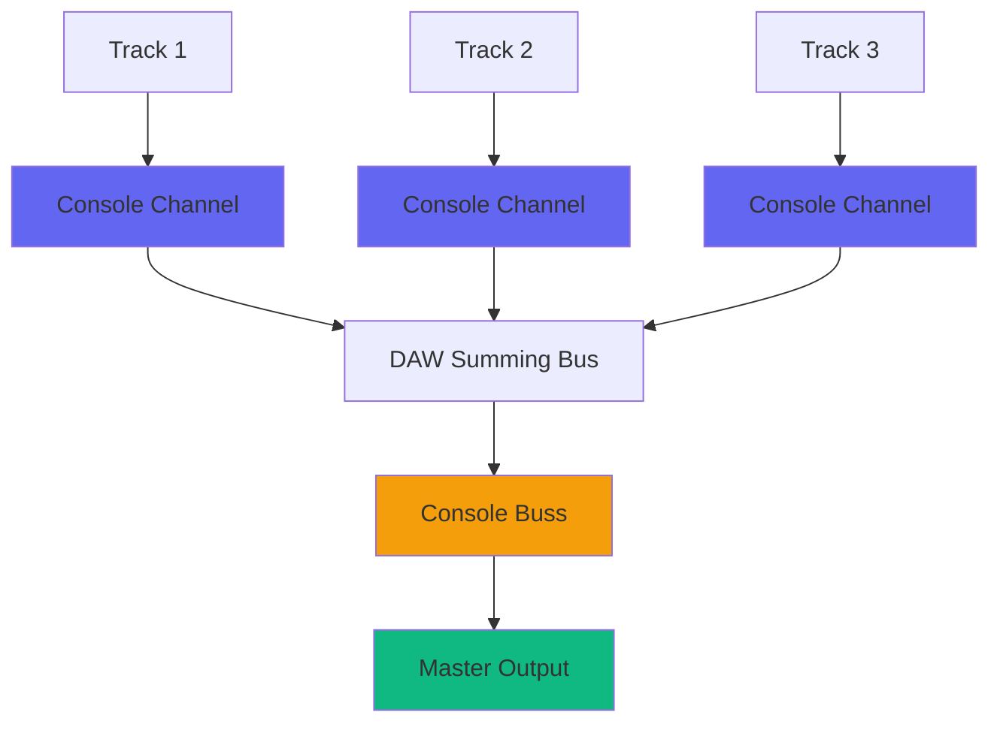
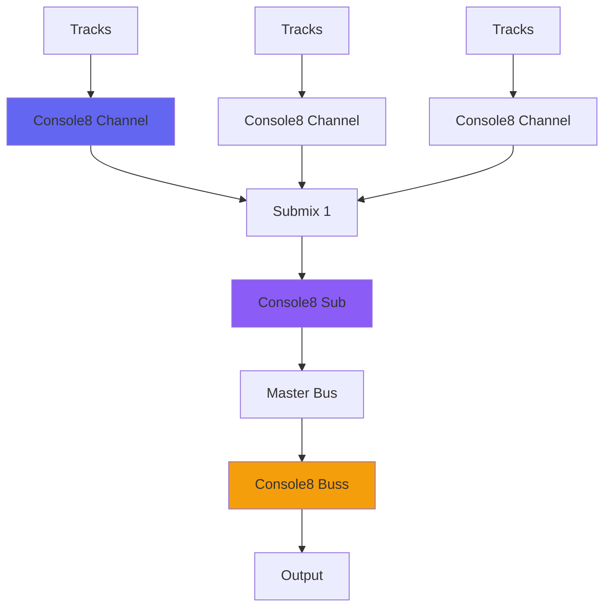

# Console Plugins

The Console system is one of Airwindows' most important and unique contributions to ITB (In-The-Box) mixing. Rather than emulating specific analog consoles, the Console system provides a fundamentally different approach to digital summing.

## Overview

Console plugins work as matched pairs: **Channel** plugins go on individual tracks, and **Buss** plugins go on the master fader. This creates a summing system that prevents the "crowding" and "flatness" that often characterizes purely digital mixes.

**Key Concept**: Each Console system uses encode/decode processing that distributes non-linearity across channels and then collects it at the buss, creating a more spacious and "3D" mix.

## How Console Works

### Signal Flow

1. **Channel Plugin** - Encodes the signal with a specific non-linearity
2. **DAW Summing** - Digital summing (pristine and transparent)
3. **Buss Plugin** - Decodes the summed signal, creating analog-like behavior

### Why This Matters

Traditional digital summing is mathematically perfect but can sound "2D" or "flat". Console's encode/decode system:

- Creates space between elements
- Prevents digital "crowding"
- Adds subtle analog-like behavior
- Maintains digital clarity and precision

## Console Versions

### Modern Consoles (Recommended)

#### Console9 (Latest)
- **Use Case**: Clean, transparent console emulation
- **Character**: Neutral, spacious
- **Best For**: Any genre, mastering-grade quality
- **Plugins**: Console9Channel, Console9Buss

#### ConsoleLA
- **Use Case**: Quad Eight console emulation
- **Character**: Warm, vintage
- **Best For**: Classic rock, retro productions
- **Plugins**: ConsoleLAChannel, ConsoleLABuss

#### ConsoleMC
- **Use Case**: MCI console emulation (bright)
- **Character**: Clear, punchy, modern
- **Best For**: Pop, rock, modern productions
- **Plugins**: ConsoleMCChannel, ConsoleMCBuss

#### ConsoleMD
- **Use Case**: MCI console with tone shaping
- **Character**: Warm MCI tone
- **Best For**: Rock, alternative
- **Plugins**: ConsoleMDChannel, ConsoleMDBuss

### Classic Consoles

#### PurestConsole
- **Character**: Most transparent, minimal coloration
- **Best For**: Pristine digital summing with subtle improvement
- **Variants**: PurestConsole, PurestConsole2, PurestConsole3

#### Console0
- **Character**: Radical, minimalist
- **Best For**: Experimental, different summing approach
- **Plugins**: Console0Channel, Console0Buss

#### Console5-7
- **Character**: Various flavors of warmth and saturation
- **Best For**: Exploring different console colors
- **Variants**: Console5, Console6, Console7 (with Cascade and Crunch)

### Console8 System

The Console8 series introduces a three-tier topology:

- **Console8Channel** - Individual tracks
- **Console8Sub** - Submix buses (drums, vocals, etc.)
- **Console8Buss** - Final master bus

Each level adds its own analog modeling and saturation characteristics.

## Usage Guidelines

### Basic Setup

1. **Place Channel plugins** on every track (or at least important tracks)
2. **Place Buss plugin** on the master fader
3. **Use the same Console version** for both (don't mix Console versions)
4. **Set all controls to 0.5** (neutral position) to start

### Advanced Techniques

#### Gain Staging
- Use trim controls to "hit" the console harder for more color
- Back off for cleaner, more transparent sound
- Each Console version has different sweet spots

#### Selective Application
- You don't need Console on every track
- Use on sources that need analog glue
- Skip on already-processed stems or loops

#### Console Mixing
- Some versions (Console7, Console8) offer multiple color options
- Console8 has "Hype" variants for brighter circuits
- Experiment with different channels/buss combinations

## Comparison Chart

| Console | Character | CPU | Transparency | Color | Best For |
|---------|-----------|-----|--------------|-------|----------|
| Console9 | Neutral | Low | ★★★★★ | ★★☆☆☆ | Modern, clean mixes |
| ConsoleLA | Warm | Med | ★★★★☆ | ★★★★☆ | Vintage rock |
| ConsoleMC | Bright | Med | ★★★★☆ | ★★★☆☆ | Pop, modern rock |
| PurestConsole | Clean | Low | ★★★★★ | ★☆☆☆☆ | Mastering |
| Console8 | Rich | High | ★★★☆☆ | ★★★★★ | Complex analog vibe |
| Console7 | Vintage | Med | ★★★☆☆ | ★★★★☆ | Retro, warm |
| Console0 | Minimal | Low | ★★★★★ | ★☆☆☆☆ | Experimental |

## Technical Details

### The Encoding Process

Console uses various non-linear encoding schemes:

1. **PurestConsole** - Minimal processing, statistical encoding
2. **Console5-7** - Saturation curves and filtering
3. **Console8** - Multi-stage analog modeling
4. **Console9** - Clean summing with subtle space

### Sample Rate Considerations

Most modern Consoles work correctly at all sample rates. Older versions (Console4, early Console5) were designed for 44.1kHz and may behave differently at higher rates.

## Related Plugins

### Console Alternatives
- **Atmosphere** - Console5 with distance effects
- **PD Console** - Console5 with PurestDrive saturation
- **EveryConsole** - Mix and match different console stages

### Complementary Plugins
- **BussColors4** - Alternative approach to mix bus coloration
- **Channel** series - Tone coloring plugins
- **Desk** series - Additional analog modeling

## Tips & Tricks

1. **Start Simple** - Use Console9 or PurestConsole to understand the concept
2. **A/B Test** - Toggle the buss plugin on/off to hear the effect
3. **Don't Overthink** - Set and forget in most cases
4. **Version Match** - Always use matching Channel/Buss pairs
5. **CPU Management** - Console is efficient; don't worry about instances
6. **Mastering** - PurestConsole or Console9 work well for mastering

## Common Questions

**Q: Do I need Console on every track?**  
A: No. Even using it on just key tracks helps, but maximum effect comes from full application.

**Q: Can I use different Console versions in one mix?**  
A: Not recommended. The encode/decode must match for proper operation.

**Q: Which Console should I start with?**  
A: Console9 for modern/clean, ConsoleLA for vintage/warm, Console0 for minimal.

**Q: Does Console replace other processing?**  
A: No. It complements EQ, compression, etc. It's about the summing, not replacement.

**Q: Is higher number always better?**  
A: No. Each version has different character. Console9 is latest but not necessarily "better" than older versions for all uses.

## Resources

- **Video Tutorial**: [Console Explained](https://www.youtube.com/airwindows)
- **Forum Discussion**: [Console Thread](https://forum.airwindows.com)
- **Source Code**: [GitHub - Console9Channel](https://github.com/airwindows/airwindows/tree/master/plugins/LinuxVST/src/Console9Channel)

---

*Last updated: 2024*  
*See also: [Tone Color](tone-color.md), [Saturation](saturation.md), [Subtlety](subtlety.md)*

