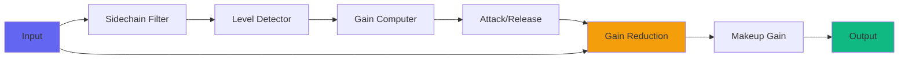
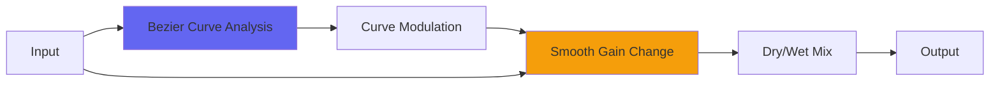
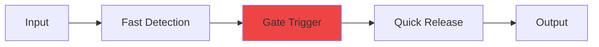

# Dynamics Plugins

Airwindows dynamics processors offer unique approaches to compression, limiting, gating, and expansion. Unlike typical "knob-heavy" compressors, many Airwindows dynamics plugins use novel algorithms that provide musical results with minimal controls.

## Overview

Dynamics processing controls the volume envelope of audio signals. Airwindows dynamics plugins range from transparent utility compressors to creative sound-shaping tools, each with distinctive characteristics.

## Core Concepts

### Traditional Dynamics Flow



### Airwindows Approach

Many Airwindows dynamics plugins skip traditional attack/release controls in favor of:

- **Curve-based compression** - Musical response without time constants
- **Bezier curves** - Smooth, alias-free gain modulation
- **Integrated processing** - Combined dynamics and saturation
- **Novel detection** - Alternative methods of measuring loudness

## Plugin Categories

### Transparent Compressors

#### BeziComp ⭐ Recommended
- **Algorithm**: Bezier curve-based compression (alias-free)
- **Controls**: Comp, Speed, Dry/Wet
- **Character**: Transparent to aggressive
- **Best For**: Mix bus, mastering, anywhere transparency matters



**Key Feature**: No aliasing artifacts, even with extreme settings.

#### Pressure6
- **Type**: Vari-mu to peak-retaining
- **Controls**: Pressure, Speed, Mewiness, Dry/Wet
- **Character**: Smooth, musical
- **Best For**: Vocals, bass, mix bus

#### curve
- **Type**: Simplest Recurve form
- **Controls**: Minimal
- **Character**: Pure compression without coloration
- **Best For**: Subtle glue, mastering

### Colored Compressors

#### Pop3 ⭐ Recommended
- **Type**: ConsoleX dynamics
- **Algorithm**: Aggressive peak control with character
- **Best For**: Drums, aggressive sources
- **Character**: Punchy, forward

#### Pressure5
- **Type**: Vari-mu style
- **Controls**: Includes ClipOnly2 output stage
- **Character**: Warm, vintage
- **Best For**: Mix bus, smooth compression

#### ButterComp2
- **Type**: Softest, smoothest compressor
- **Algorithm**: Gentle, musical response
- **Best For**: Gentle smoothing, vocals
- **Character**: Silky, transparent

### Specialized Dynamics

#### DigitalBlack ⭐ Recommended
- **Type**: Quick, staccato gate
- **Use Case**: Tight gating, noise reduction
- **Character**: Fast, precise
- **Best For**: Drums, percussive material



#### Gatelope ⭐ Recommended
- **Type**: Gate with integrated filters
- **Feature**: Shapes tone while gating
- **Best For**: Creative gating, rhythmic effects
- **Character**: Unique, musical

#### Thunder
- **Type**: Compressor that enhances subsonic bass
- **Feature**: Retains or exaggerates sub frequencies
- **Best For**: Bass-heavy material, EDM
- **Character**: Deep, powerful

#### Overheads
- **Type**: Compresses only part of the signal
- **Feature**: Selective frequency compression
- **Best For**: Drum overheads, cymbals
- **Character**: Unusual, targeted

### Peak Control

#### Logical4
- **Type**: Classic 2-buss compressor
- **Algorithm**: SSL-style peak control
- **Best For**: Mix bus, aggressive material
- **Character**: Clean, punchy

#### BlockParty
- **Type**: Moderately saturated analog limiter
- **Feature**: Saturation + limiting
- **Best For**: Individual tracks, adding weight
- **Character**: Warm, saturated

#### Pyewacket ⭐ Recommended
- **Type**: Old school transient compression
- **Feature**: High definition transients, no fatness
- **Best For**: Drums, percussion, transient sources
- **Character**: Clean, energetic

### Creative Dynamics

#### SurgeTide
- **Type**: Surge and flow dynamics
- **Feature**: Rhythmic, breathing compression
- **Best For**: Creative effects, sidechaining alternative
- **Character**: Pulsing, organic

#### Swell
- **Type**: Dial-an-attack
- **Feature**: Like reverse compression/sidechaining
- **Best For**: Swells, reverse effects
- **Character**: Backwards, dreamy

#### Compresaturator
- **Type**: Fades between compression and soft clipping
- **Feature**: Hybrid dynamics/saturation
- **Best For**: Aggressive processing, distortion
- **Character**: Edgy, saturated

### Specialty Applications

#### BrassRider
- **Type**: One Weird Trick for drum overheads in metal
- **Feature**: Specialized for metal overheads
- **Best For**: Metal drum overheads specifically
- **Character**: Aggressive, controlled

#### Point
- **Type**: Explosive transient designer
- **Feature**: Extreme transient enhancement
- **Best For**: Making hits hit harder
- **Character**: Explosive, forward

#### Podcast/PodcastDeluxe
- **Type**: Voice-optimized compression stack
- **Feature**: Multiple compressors + processing for voice
- **Best For**: Podcasts, voice recording
- **Character**: Broadcast-ready

## Compression Styles Comparison

| Plugin | Style | CPU | Transparency | Color | Aggression |
|--------|-------|-----|--------------|-------|------------|
| BeziComp | Modern | Med | ★★★★★ | ★☆☆☆☆ | ★★★★★ |
| Pressure6 | Vari-mu | Low | ★★★★☆ | ★★☆☆☆ | ★★★☆☆ |
| Pop3 | Peak | Low | ★★★☆☆ | ★★★☆☆ | ★★★★★ |
| ButterComp2 | Gentle | Low | ★★★★★ | ★☆☆☆☆ | ★☆☆☆☆ |
| Logical4 | SSL | Low | ★★★★☆ | ★★☆☆☆ | ★★★★☆ |
| curve | Clean | Low | ★★★★★ | ☆☆☆☆☆ | ★★☆☆☆ |
| Pyewacket | Transient | Low | ★★★★☆ | ★☆☆☆☆ | ★★★★☆ |

## Usage Guidelines

### Mix Bus Compression

**Recommended Plugins:**
1. **BeziComp** - Most transparent, alias-free
2. **Pressure6** - Musical, smooth
3. **Logical4** - SSL-style glue
4. **curve** - Subtle, pure compression

**Settings:**
- Light compression (2-3dB reduction)
- Slower speed/attack
- Minimal dry/wet (mostly dry)

### Vocal Compression

**Recommended Plugins:**
1. **ButterComp2** - Smoothest
2. **Pressure6** - Warm, vintage
3. **BeziComp** - Transparent control
4. **Podcast** - Broadcast style

**Settings:**
- Medium compression (4-6dB reduction)
- Fast enough to catch transients
- Balance between control and naturalness

### Drum Compression

**Recommended Plugins:**
1. **Pop3** - Aggressive, punchy
2. **Pyewacket** - Transient focus
3. **Point** - Explosive enhancement
4. **DrumSlam** - Heavy tape-style

**Settings:**
- Fast attack for transient control
- OR slow attack to let transients through
- Higher ratios acceptable
- Use in parallel for New York compression

### Bass Compression

**Recommended Plugins:**
1. **Pressure6** - Smooth, even
2. **Thunder** - Sub enhancement
3. **BeziComp** - Clean control
4. **PurestSquish** - Bass bloom

**Settings:**
- Medium attack to preserve note attacks
- Longer release for smoothness
- Watch for sub frequency buildup

## Advanced Techniques

### Parallel Compression

Most Airwindows compressors with Dry/Wet controls can do parallel compression internally:

1. Set compression aggressively
2. Back off Dry/Wet to blend
3. More controlled than aux-send method

### Serial Compression

Stack compressors for different purposes:

```
Source → Light compression (even out) → Heavy compression (control peaks) → Saturation
```

Example chain:
1. **ButterComp2** (gentle smoothing)
2. **BeziComp** (peak control)
3. **Desk4** (saturation)

### Sidechain Tricks

Some dynamics plugins respond to input characteristics:
- Feed transient-heavy material for responsive compression
- Filter input for frequency-selective compression
- Use **Overheads** for built-in frequency selectivity

## Common Questions

**Q: Why so few controls on some compressors?**  
A: Airwindows philosophy: find the musical setting, make it automatic. Attack/release are often "pre-tuned" for musical results.

**Q: Which compressor for mastering?**  
A: **BeziComp** for transparency, **curve** for purity, **Pressure6** for warmth.

**Q: How to use without attack/release controls?**  
A: The "Speed" control (where present) combines attack and release musically. Start at 0.5 and adjust to taste.

**Q: Can I use multiple dynamics plugins?**  
A: Yes! Many Airwindows dynamics work well in series. Each does something different.

**Q: Why does BeziComp sound different?**  
A: It uses Bezier curves for gain modulation, eliminating aliasing artifacts that other compressors create.

## Technical Concepts

### Aliasing in Dynamics

Traditional compressors create aliasing when gain changes rapidly. BeziComp solves this with Bezier curve modulation.

### Curve-Based Compression

Instead of attack/release times, curve-based compressors (Recurve, curve, BeziComp) use mathematical curves that respond musically without time constants.

### Vari-Mu Emulation

Pressure series emulates tube-based vari-mu compression:
- Slower by nature
- More musical
- Less artifacts
- Subtle harmonic addition

## Related Categories

- **[Clipping](clipping.md)** - Alternative peak control
- **[Saturation](saturation.md)** - Often combined with dynamics
- **[Consoles](consoles.md)** - Built-in dynamics in some versions
- **[Subtlety](subtlety.md)** - Mastering dynamics

## Resources

- **Parallel Compression Guide**: [Using Dry/Wet for NYC](https://airwindows.com)
- **BeziComp Deep Dive**: [Understanding Bezier Compression](https://airwindows.com)
- **Source Code**: [GitHub - Dynamics](https://github.com/airwindows/airwindows/tree/master/plugins/LinuxVST/src/)

---

*Last updated: 2024*  
*See also: [Clipping](clipping.md), [Saturation](saturation.md), [Effects](effects.md)*

