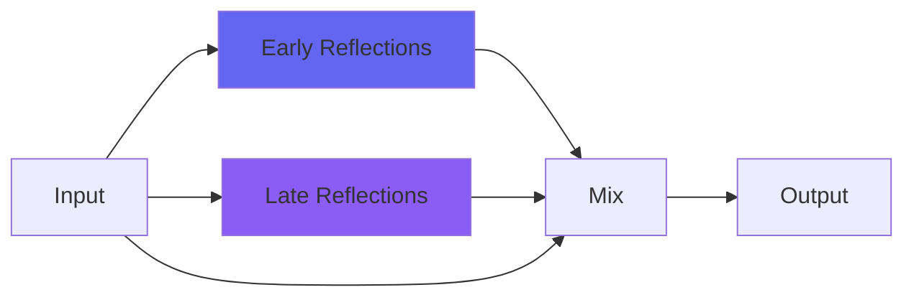
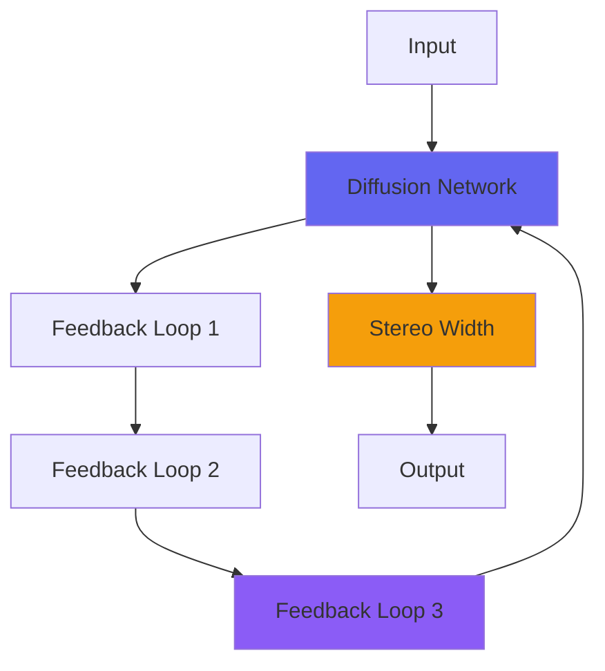
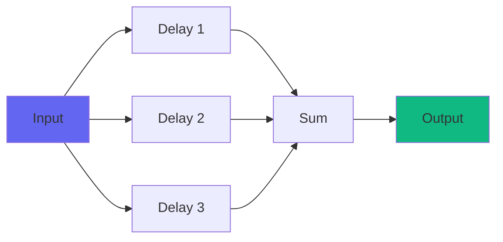
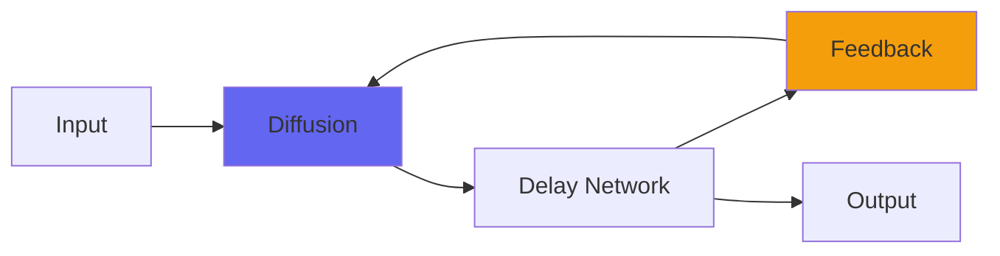

# Reverb Plugins

Airwindows reverbs range from realistic room simulations to infinite ambient spaces. Rather than trying to exactly emulate hardware units, these reverbs explore unique algorithms and creative approaches to spatial audio.

## Overview

The Airwindows reverb collection includes over 30 plugins, from small rooms to cathedrals, from natural spaces to impossible dimensions. Many use novel algorithms like Householder matrices, feedforward topology, and Bezier undersampling.

## Reverb Types

### Realistic Spaces

#### kStation ⭐ Recommended
- **Space**: Small room (David Bowie's vocal reverb)
- **Character**: Intimate, realistic
- **Best For**: Vocals, close-miked instruments
- **Algorithm**: Carefully calibrated small room



#### kBeyond ⭐ Recommended
- **Space**: Recital hall
- **Character**: Natural, present
- **Best For**: Classical, acoustic music
- **Size**: Medium hall

#### kCathedral5 ⭐ Recommended
- **Space**: Large cathedral
- **Character**: Massive, enveloping
- **Best For**: Ambient, pads, atmospheric
- **Features**: Adjustable listener position

#### kAlienSpaceship ⭐ Recommended
- **Space**: Unreal realistic reverb
- **Character**: Unique, otherworldly but believable
- **Best For**: Creative, sci-fi, unique spaces
- **Special**: Neither realistic nor artificial

### Plate Reverbs

#### kPlate140 ⭐ Recommended
- **Type**: Next-generation plate
- **Character**: Bright, smooth
- **Best For**: Vocals, snare, general use
- **Size**: Medium plate

#### kPlate240 ⭐ Recommended
- **Type**: Smaller, gold foil texture
- **Character**: Brighter, more dense
- **Best For**: Percussion, bright sources
- **Size**: Small plate

#### kPlateA/B/C/D
- **Type**: Abbey Road-inspired plates
- **Character**: Each with unique color
- **Best For**: Vintage plate tones
- **Note**: Different plates for different needs

### Creative/Ambient Reverbs

#### Galactic ⭐ Recommended
- **Type**: Super-reverb for pads
- **Character**: Infinite, lush
- **Best For**: Ambient, pads, space music
- **Special**: Designed specifically for atmospheric sounds



#### Galactic2/Galactic3
- **Evolution**: Refined versions
- **Galactic3**: Better undersampling for high sample rates
- **Character**: Even more expansive

#### kCosmos ⭐ Recommended
- **Type**: Infinite space ambient or titanic hall
- **Character**: Massive, evolving
- **Best For**: Huge spaces, cinematic
- **Special**: Can create evolving textures

#### Infinity2
- **Type**: Sustained and layered sounds forever
- **Character**: Never-ending, building
- **Best For**: Drones, ambient, sound design
- **Features**: Kill switch to stop the build-up

### Bright/Special Reverbs

#### ClearCoat ⭐ Recommended
- **Type**: Array of bright ambience reverbs
- **Character**: Crystalline, present
- **Best For**: Modern pop, bright sources
- **Special**: Multiple bright reverb algorithms

#### CreamCoat ⭐ Recommended
- **Type**: Swiss army knife reverb
- **Character**: Soft, undersampled
- **Best For**: Versatile, all-purpose
- **Special**: Warm, smooth character

#### CrunchCoat ⭐ Recommended
- **Type**: Cursed retro digital reverb
- **Character**: Lo-fi, vintage digital
- **Best For**: Retro aesthetics, lo-fi
- **Special**: Deliberately "bad" digital reverb

### Chamber/Echo Reverbs

#### Chamber ⭐ Recommended
- **Type**: Feedforward reverb (golden ratio)
- **Character**: Clean, mathematical
- **Best For**: Natural echo chamber sound
- **Algorithm**: Golden ratio spacing

#### Chamber2
- **Type**: Feedforward + blur delay + glitch
- **Character**: Chamber with extras
- **Best For**: Creative chamber sounds
- **Special**: Additional processing options

#### kChamberAR
- **Type**: Tape echo into chamber
- **Character**: Vintage, warm
- **Best For**: Dub, vintage echo effects
- **Algorithm**: Tape into chamber topology

### Guitar-Specific Reverbs

#### kGuitarHall2 ⭐ Recommended
- **Type**: Loud room for guitar
- **Character**: Accentuates midrange
- **Best For**: Electric guitar, rock
- **Special**: Makes guitars cut through

### Matrix Reverbs

#### MatrixVerb
- **Type**: Wildly adjustable matrix reverb
- **Character**: Colorful, flexible
- **Best For**: Deep spaces, experimentation
- **Algorithm**: Matrix-based processing

#### Reverb
- **Type**: Simplified MatrixVerb
- **Character**: Optimized per size
- **Best For**: Quick, good-sounding reverb
- **Note**: Easier to use than MatrixVerb

#### VerbSixes
- **Type**: Householder matrix calibration
- **Character**: Reference quality
- **Best For**: Technical applications
- **Algorithm**: 6x6 Householder matrices

### Dual-Mono Reverbs

#### Verbity2
- **Type**: Dual-mono with stereo crossmodulation
- **Character**: Wide, expanded
- **Best For**: Stereo sources
- **Algorithm**: Feedforward with crossmod

#### MV2
- **Type**: Dual-mono Midiverb style
- **Character**: Retro, simple
- **Best For**: High sample rates
- **Algorithm**: BitShiftGain-based

### Specialized Reverbs

#### NonlinearSpace ⭐ Recommended
- **Type**: Flexible reverb with nonlinearity
- **Character**: Unique, flexible
- **Best For**: All-purpose with character
- **Special**: Nonlinear processing

#### PocketVerbs
- **Type**: Special effects reverbs
- **Character**: Various weird reverbs
- **Best For**: Creative effects
- **Special**: Collection of odd reverbs

## Reverb Algorithms Comparison

### Feedforward vs Feedback

**Feedforward** (Chamber, Verbity):


**Feedback** (Galactic, Infinity):


## Usage Guidelines

### Vocals

**Recommended:**
- **kStation** - Intimate, present
- **kPlate140** - Classic vocal plate
- **ClearCoat** - Modern, bright

**Settings:**
- Short to medium decay
- Pre-delay for clarity
- Don't drown the vocal

### Drums

**Rooms:**
- **kBeyond** - Natural room
- **kGuitarHall2** - Loud, aggressive

**Plates:**
- **kPlate140** - Snare reverb
- **kPlateA/B** - Vintage vibe

**Settings:**
- Short decay for tight sound
- Gated reverb for 80s sound
- Room mics: realistic spaces

### Ambient/Pads

**Recommended:**
- **Galactic3** - Infinite lush
- **kCosmos** - Massive space
- **Infinity2** - Never-ending
- **kCathedral5** - Huge cathedral

**Settings:**
- Long decay times
- High diffusion
- Stereo width
- Let it build

### Guitars

**Recommended:**
- **kGuitarHall2** - Rock/metal
- **Chamber** - Clean, natural
- **kBeyond** - Recital hall

**Settings:**
- Match decay to tempo
- Not too wet (20-30%)
- Consider pre-delay

## Comparison Chart

| Reverb | Type | Size | CPU | Realism | Character |
|--------|------|------|-----|---------|-----------|
| kStation | Room | Small | Low | ★★★★★ | Intimate |
| kBeyond | Hall | Med | Med | ★★★★★ | Present |
| kCathedral5 | Church | Huge | High | ★★★★☆ | Massive |
| kPlate140 | Plate | Med | Med | ★★★★☆ | Smooth |
| Galactic3 | Ambient | Inf | Med | ★★☆☆☆ | Lush |
| ClearCoat | Bright | Var | Low | ★★★☆☆ | Crystalline |
| Chamber | Chamber | Med | Low | ★★★★☆ | Clean |
| NonlinearSpace | Flex | Var | Med | ★★★☆☆ | Unique |

## Advanced Techniques

### Parallel Reverb

1. Send source to aux track
2. Add reverb 100% wet
3. Mix to taste
4. Process reverb differently than dry

### Pre-Delay

- Separates reverb from source
- Increases clarity
- Match to tempo (1/16, 1/8 notes)
- Essential for vocals

### Filtering Reverb

- Highpass to remove mud
- Lowpass to reduce brightness
- EQ reverb returns
- Keep reverb out of key frequencies

### Layering Reverbs

```
Source → Small Room → Medium Hall → Master
```

- Small room for realism
- Medium hall for depth
- Creates believable space

## Tips & Tricks

1. **Less is More** - Start with less reverb than you think
2. **Tempo Match** - Decay times related to song tempo
3. **Mono Compatible** - Check reverb in mono
4. **Automate** - Change reverb for sections
5. **Pre-Delay** - Almost always helps clarity
6. **Filter** - Cut lows and highs from reverb
7. **Parallel** - More control over blend

## Common Questions

**Q: Which reverb for general use?**  
A: **kBeyond** (natural), **CreamCoat** (versatile), or **NonlinearSpace** (flexible).

**Q: Longest reverb tail?**  
A: **Infinity2** - literally infinite with feedback.

**Q: Most realistic?**  
A: **kStation** (small), **kBeyond** (medium), **kCathedral5** (large).

**Q: CPU efficient reverb?**  
A: **Chamber**, **kStation**, **MV2**.

**Q: Plate reverb?**  
A: **kPlate140** (modern), **kPlate240** (bright), **kPlateA-D** (vintage).

**Q: For ambient/pads?**  
A: **Galactic3** first choice, **kCosmos** for massive, **Infinity2** for drones.

## Technical Details

### Householder Matrices

**VerbSixes** uses Householder reflection matrices:
- Mathematically perfect diffusion
- No coloration
- Reference quality
- 6x6 matrices (vs typical 4x4 or 8x8)

### Golden Ratio Spacing

**Chamber** uses golden ratio for delay times:
- Avoids metallic resonances
- Natural spacing
- Mathematically optimized
- Feedforward topology

### Bezier Undersampling

**kCathedral3**, **Galactic3**, **CreamCoat**:
- Reduces CPU at high sample rates
- Smooth, artifact-free
- Maintains quality
- Warm character

## Related Categories

- **[Ambience](ambience.md)** - Delays and echoes
- **[Effects](effects.md)** - Creative processing
- **[Stereo](stereo.md)** - Spatial effects

## Resources

- **Reverb Theory**: [Understanding Reverb Algorithms](https://airwindows.com)
- **Video Demos**: [Reverb Shootout](https://youtube.com/airwindows)
- **Source Code**: [GitHub - Reverb](https://github.com/airwindows/airwindows/tree/master/plugins/LinuxVST/src/)

---

*Last updated: 2024*  
*See also: [Ambience](ambience.md), [Stereo](stereo.md), [Effects](effects.md)*

