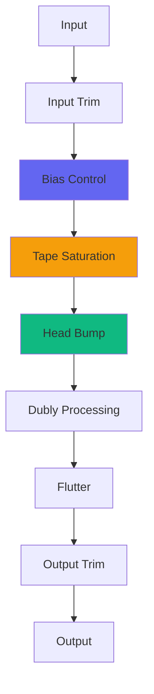
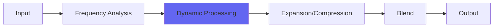

# Tape Emulation Plugins

Airwindows tape emulations capture the character of analog tape without trying to perfectly model specific hardware. From subtle warmth to heavy saturation, these plugins bring magnetic tape characteristics to digital audio.

## Overview

Tape emulation involves multiple components: bias, saturation, noise, flutter, head bump, and high-frequency roll-off. Airwindows tape plugins range from simple to complex, each focusing on different aspects of the tape sound.

## Tape Signal Flow


## Core Tape Plugins

### ToTape8 ⭐ Recommended

The flagship tape emulation - comprehensive and refined.

**Features:**
- **Gain Staging** - Input and output trim
- **Bias** - Under-bias to over-bias control
- **Dubly** - Optimized noise reduction emulation
- **Saturation** - Multiple tape formulas
- **Head Bump** - Bass resonance



**Best For:**
- Mix bus processing
- Mastering
- Adding warmth and glue
- Complete tape experience

**Usage:**
1. Set input gain for desired saturation
2. Adjust bias (0.5 = neutral, lower = warmer)
3. Blend with Dry/Wet if needed
4. Use output trim to compensate

### ToTape7

Previous generation with different character.

**Differences from ToTape8:**
- Less refined gain staging
- Different bias response
- Original Dubly implementation
- Still useful for specific sounds

**Best For:**
- Different flavor than ToTape8
- Lighter processing
- Experimentation

### ToTape6

Earlier version with flutter emphasis.

**Character:**
- More prominent flutter
- Different saturation curve
- Less refined than 7/8
- Unique vintage quality

### ToTape5

Classic tape sound, simpler controls.

**Character:**
- Straightforward tape emulation
- Good starting point
- Less features but effective

## Specialized Tape Plugins

### TapeHack ⭐ Recommended

Abstract tape realism for software.

**Concept:**
- Not literal tape emulation
- Captures tape "feel"
- Novel approach to tape character
- Dimension and depth

**Best For:**
- Unique tape character
- Mix bus
- When literal emulation isn't needed

### FromTape

Minimalist, cleaner tape emulation.

**Character:**
- Less colored than ToTape series
- Cleaner, more modern
- Subtle tape qualities
- Transparent warmth

**Best For:**
- Subtle tape character
- Mastering
- When full tape is too much

### Tape

Simplified, all-purpose tape.

**Character:**
- Chris's personal favorite
- Simple controls
- Good general tape sound
- "Set and forget"

**Best For:**
- Quick tape tone
- Learning tape emulation
- All-purpose use

### IronOxideClassic2 ⭐

Bandpassy tape sim with modern updates.

**Character:**
- Old school heavy coloration
- Pronounced midrange
- High sample rate support
- Aliasing control

**Best For:**
- Vintage tape color
- Heavy processing
- Distinct midrange character

**Evolution:**
- Classic: Original, simple
- IronOxide5: Full-featured, colored
- Classic2: Updated classic with modern fixes

## Tape Components (Standalone)

### TapeBias

Isolated bias control from ToTape.

**Usage:**
- Under-bias: Darker, warmer, more saturated
- Over-bias: Brighter, thinner, less saturated
- Neutral (0.5): Balanced

**Best For:**
- Tone shaping
- Before or after saturation
- Experimenting with bias

### Flutter2 ⭐

Standalone flutter effect.

**Character:**
- Tape wow and flutter
- Updated from original Flutter
- Pitch modulation
- Vintage vibe

**Best For:**
- Adding movement
- Lo-fi effects
- Vintage character
- Creative modulation

### TapeDust ⭐

Special treble-erode noise.

**Character:**
- "Slew noise" plugin
- High-frequency texture
- Tape-like noise character
- Subtle or extreme

**Best For:**
- Adding tape texture
- High-frequency "dirt"
- Lo-fi processing

## Tape-Related Processing

### Dubly3 ⭐ Recommended

Refined Dolby-style noise reduction emulation.



**Usage:**
- Not actual noise reduction
- Adds "seventies sonics"
- Retro vibe and atmosphere
- Character processing

**Best For:**
- Vintage character
- Atmosphere
- Warm, retro sound

### Sinew ⭐ Recommended

Sine-wave slew clipping for tape bias effect.

**Character:**
- Tape-like warmth
- Slew limiting
- Sine wave generation
- Smooth saturation

**Best For:**
- Tape warmth simulation
- High-frequency smoothing
- Analog character

### ChromeOxide

Alternate vintage tape sonics.

**Character:**
- Different from IronOxide
- Vibey, colored
- Distinct tape flavor

## Usage Scenarios

### Mix Bus Tape

**Recommended:** ToTape8, TapeHack

**Settings:**
- Light to moderate drive
- Bias around 0.4-0.5
- Head bump to taste
- Dry/wet for parallel blend

**Purpose:**
- Glue mix together
- Add warmth
- Subtle saturation
- Analog character

### Mastering Tape

**Recommended:** ToTape8, FromTape

**Settings:**
- Very light processing
- Bias neutral or slightly under
- Minimal saturation
- Mostly for tone shaping

**Purpose:**
- Final polish
- Subtle warmth
- Slight compression from saturation
- Professional finish

### Individual Tracks

**Recommended:** Tape, IronOxideClassic2, TapeHack

**Settings:**
- Can be more aggressive
- Match character to source
- Use for effect, not just polish
- Experiment with bias

**Purpose:**
- Track character
- Distinct tone
- Warmth and body
- Sit in mix better

### Creative/Lo-Fi

**Recommended:** IronOxideClassic2, Flutter2, TapeDust

**Settings:**
- Extreme settings OK
- Push bias to extremes
- High flutter amounts
- Stack effects

**Purpose:**
- Lo-fi aesthetic
- Vintage/retro sound
- Movement and texture
- Degradation

## Tape Characteristics

### Head Bump

The bass resonance from tape playback head:

- Centered around 50-60Hz
- Adds warmth and body
- Can cause buildup
- Use sparingly on mix bus
- Great on individual tracks

### Saturation

Tape saturation characteristics:

- **Soft clipping** - Gentle compression
- **Harmonic richness** - Even harmonics
- **Frequency dependent** - More at high levels
- **Musical** - Enhances rather than destroys

### Flutter/Wow

Pitch variation from tape transport:

- **Wow** - Slow variations (speed stability)
- **Flutter** - Fast variations (motor/capstan)
- **Character** - Adds life and movement
- **Amount** - Subtle to extreme

### High-Frequency Roll-off

Natural tape frequency response:

- Loss of extreme highs
- Smooth, analog feel
- Reduces harshness
- Part of tape sound

## Comparison Chart

| Plugin | Complexity | CPU | Color | Character | Best Use |
|--------|-----------|-----|-------|-----------|----------|
| ToTape8 | High | Med | ★★★★☆ | Modern, refined | Mix bus, mastering |
| TapeHack | Med | Low | ★★★☆☆ | Abstract, deep | Mix bus, creative |
| FromTape | Low | Low | ★★☆☆☆ | Clean, subtle | Mastering, subtle |
| Tape | Low | Low | ★★★☆☆ | Simple, good | All-purpose |
| IronOxideClassic2 | Med | Med | ★★★★★ | Colored, vintage | Heavy processing |
| Flutter2 | Low | Low | ★★☆☆☆ | Movement | Lo-fi, texture |

## Tips & Tricks

### Gain Staging

Critical for tape emulation:

1. **Hit tape harder** for more saturation
2. **Lighter input** for subtler effect
3. **Compensate output** to match levels
4. **Watch meters** - tape clips differently

### Bias Control

The secret to tape tone:

- **Under-bias** (< 0.5): Warmer, darker, more saturated
- **Neutral** (0.5): Balanced tape response
- **Over-bias** (> 0.5): Brighter, cleaner, less saturated

### Parallel Tape

Blend tape effect:

1. Process with aggressive tape settings
2. Blend with dry signal
3. Get tape character without losing detail
4. Works great on drums

### Stacking Tape Plugins

Build complex tape sound:

```
Source → TapeBias → ToTape8 → Flutter2 → Output
```

- Each adds different character
- Light settings on each
- Build up complexity
- More realistic behavior

## Common Questions

**Q: Which ToTape version should I use?**  
A: **ToTape8** is most refined. Try others for different flavors.

**Q: How much tape is too much?**  
A: If you're asking, you're probably using too much. Tape should enhance, not dominate.

**Q: Can I use tape on master?**  
A: Yes! ToTape8 or FromTape work great for mastering.

**Q: Why does my mix sound muddy with tape?**  
A: Head bump buildup. Reduce bass resonance or use less tape on bass-heavy tracks.

**Q: Tape on every track?**  
A: You can, but not necessary. Mix bus tape often enough.

**Q: Best tape for drums?**  
A: ToTape8 or IronOxideClassic2 for character. TapeHack for glue.

## Technical Concepts

### Tape Hysteresis

Magnetic tape has memory:
- Creates saturation
- Adds harmonics
- Compresses dynamics
- Part of tape sound

### Tape Compression

Natural tape compression:
- Softer peaks
- Sustained notes
- Musical leveling
- Not traditional compression

### Tape Modulation Noise

Noise modulates with signal:
- Not just added noise
- Interacts with audio
- Part of character
- More realistic

## Related Categories

- **[Saturation](saturation.md)** - Related processing
- **[Lo-Fi](lo-fi.md)** - Tape degradation
- **[Subtlety](subtlety.md)** - Subtle tape processing

## Resources

- **Tape Theory**: [Understanding Tape Emulation](https://airwindows.com)
- **Video Comparison**: [ToTape Shootout](https://youtube.com/airwindows)
- **Bias Guide**: [Using TapeBias](https://airwindows.com)

---

*Last updated: 2024*  
*See also: [Saturation](saturation.md), [Lo-Fi](lo-fi.md), [Tone Color](tone-color.md)*

