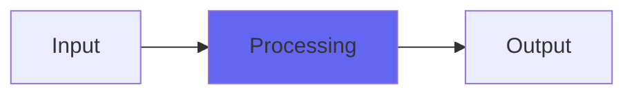

# Acceleration

## Quick Info

| | |
|---|---|
| **Category** | Brightness |
| **Type** | Brightness |
| **Status** | Stable |

## Description

an acceleration limiter that tames edge, leaves brightness

## Detailed Overview

As requested, I’ve made a dedicated acceleration limiter, like the one in ToVinyl4. You don’t have to mess with Groove Wear, or highpass anything: as a result, this ends up being the ‘high end’ acceleration limiter, mastering grade and useful in situations where ToVinyl might be overkill (ToVinyl was made in an era where I still had to make ‘amazing marketable plugins with lots of features so people would pay $50 quickly before it got all pirated etc’)

Ah, I remember those days ;P

But now, it’s different because Acceleration is free! AU, Mac and PC VST (stay tuned for a surprise on that front) and if you can’t pay, go ahead and use it anyway. If you can, please do because I think the usefulness of me doing this work will become increasingly obvious, and the usefulness of me opensourcing plugin code has also become increasingly obvious. And it’s brought you Acceleration, here and now.

The reason to be excited about that is, Acceleration’s not a simple filter. It pretty much targets exactly the digital behavior that creates Gibb effect overshoots (the reason you often have to pad heavily limited material down to stop it being crackly and glare-y) and would probably work very well as literally an acceleration limiter for record cutting heads. But, in a largely digital world, it might be even more useful because you can feed it any old ITB mix, any weird edgy source material, and it’ll clean up the nasty digital brightness while not sounding like it’s doing anything. Check the video (it should be relatively obvious if you’ve got half decent tweeters) and try it out. The key is to not try and get the apparent volume of the highs to be less: instead, you’re going after the character, or the presentation. If highs seem to be coming forward with nasty spikey extra energy, Acceleration will fix that tonal problem without altering the basic mix balance.

## Signal Flow

## How It Works

Acceleration processes audio in the Brightness category. See the description above for specific functionality.

## Usage Tips

- Start with conservative settings
- A/B compare to hear the effect clearly
- Use in context with other processing
- Trust your ears over visual meters

## Related Plugins

Browse other [Brightness](../categories/brightness.md) plugins.

## Technical Details

**Source Code**: [View on GitHub](https://github.com/airwindows/airwindows/tree/master/plugins/LinuxVST/src/Acceleration)

**Categories**: Brightness

**Available Formats**:
- Mac AU
- Mac VST
- Windows VST
- Linux VST

## Resources

- [All Airwindows Plugins](../../README.md)
- [Category: Brightness](../categories/brightness.md)
- [Airwindows Website](https://www.airwindows.com)
- [Airwindows GitHub](https://github.com/airwindows/airwindows)

---

*Part of the Airwindows plugin collection - Open source audio processing plugins*

*Last updated: 2024*
