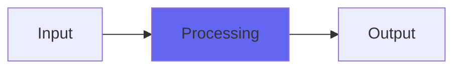

# Acceleration2

## Quick Info

| | |
|---|---|
| **Category** | Brightness |
| **Type** | Brightness |
| **Status** | Latest Release |

## Description

Acceleration, better! Updated for high sample rate and more extreme effect

## Detailed Overview

Acceleration2 is an updated version of my high-frequency limiter, Acceleration. It’s like a brightness control that doesn’t really take away apparent brightness, just glues it really hard. Acceleration limiting is what you’d use mastering to vinyl, to avoid burning out the cutting head: it will get you a nice retro tone without obviously coloring things. It is not an ’emulation’ of any specific gear: real mastering engineers are not looking for ’emulation of Neumann sound’ or anything like that, they’re looking to get the functionality of this in the most colorless way.

It’s been updated to work exactly the same at all sample rates (the previous one had issues adapting to them) and now has more intense depth of effect: if you crank it up you can make things real soft and dull. Don’t do that :) the purpose is not to do what you could do with an EQ, the purpose is to glue things and take the edge off the super-highs without harming the sparkle and air of the recording. Acceleration2 can do that real well: you might even find it useful if you’re doing very digital mixes and avoiding my other stuff like Console7. If you put this on the mix buss of an otherwise super-digital mix, you can make the highs prettier without making them any darker or duller. Do that by applying only small amounts of the Limit control.

## Signal Flow

## How It Works

Acceleration2 processes audio in the Brightness category. See the description above for specific functionality.

## Usage Tips

- Start with conservative settings
- A/B compare to hear the effect clearly
- Use in context with other processing
- Trust your ears over visual meters

## Related Plugins

Browse other [Brightness](../categories/brightness.md) plugins.

## Technical Details

**Source Code**: [View on GitHub](https://github.com/airwindows/airwindows/tree/master/plugins/LinuxVST/src/Acceleration2)

**Categories**: Brightness

**Available Formats**:
- Mac AU
- Mac VST
- Windows VST
- Linux VST

## Resources

- [All Airwindows Plugins](../../README.md)
- [Category: Brightness](../categories/brightness.md)
- [Airwindows Website](https://www.airwindows.com)
- [Airwindows GitHub](https://github.com/airwindows/airwindows)

---

*Part of the Airwindows plugin collection - Open source audio processing plugins*

*Last updated: 2024*
