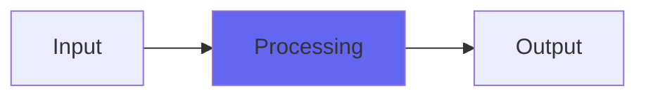

# ADT

## Quick Info

| | |
|---|---|
| **Category** | Ambience |
| **Type** | Ambience |
| **Status** | Latest Release |

## Description

a double short delay tap with saturation

## Detailed Overview

ADT means ‘artificial double-tracking’. You could also call it fixed flanging. It’s a single short delay, as heard on lots of Beatles tracks. It’s now my job to explain what’s different about the Airwindows ADT, what you can do with it beyond the obvious ‘stick it on like a preset and pretend you are a Beatle’, and why you’d bother.

With the Airwindows ADT, you get two delay taps (making it A3T?) and an important feature: the mix sliders used to apply the delayed taps are ‘attenuverters’. That’s a word from Modular Synthesizer Land, which means you get both output level control and the ability to invert the output. Here’s why that matters.

If you apply a fixed delay tap, you get an effect called ‘comb filtering’ where you’re emphasizing and cancelling frequencies based on how long the delay is. You’d think that would sound really strange, but it’s the same way you hear a direct sound and also the sound bouncing off a floor or wall: we naturally hear through comb filtering rather well, which is why room design is important in studio control rooms. (you could have a bass frequency getting cancelled, be unable to hear it at all at your listening position, and yet things will still sound perfectly normal.) Applying a quick delay like this can make your sound richer and more textural, and a little more ambient. If it’s a very short delay it may not be heard as an echo at all.

But, if you’re using an INVERTED delay tap, something else happens: the shorter the delay and the closer to the volume of the dry signal, the more it’ll cancel out the bass. You’ll still get all the comb filtering effects, but you’ll also be removing lows, either the deep lows or even low midrange if the delay’s really short.

If you blend two taps that are both inverted, you can cut bass while averaging out the comb-filter effects. If the taps are in phase (not inverted) what you’re doing is reinforcing the bass, because the cancellation effects will run out below a certain frequency and just add together. All this is using very quick delays, though ADT lets you lengthen them to where they’re slapbacks. Don’t be too distracted by that, part of what makes ADT its own effect is the ability to shape the tone with delays too quick to hear as echoes.

Finally, now that you know you can cut bass using these very quick delays, or reinforce it, or any combination you like… there’s a headroom control. ADT will distort like crazy using low headroom. That can be used as a distortion effect… but it’s not just ordinary distortion, it’s a combination of Spiral into Console5’s buss (PurestConsole, for clarity and well-behavedness). These don’t perfectly cancel out. Instead, it produces a slightly leaned-out, skinnier tone to complement the way ADT fattens things up. If you’re using it to thin bass, it’ll be even more effective. If you’re reinforcing the body of the sound, it’ll color things in a subtle but interesting way. And of course if you love it, you can set up mixes that way (swap out Console5Channel for original Spiral, either on mix elements you’d like a little thinner and more energetic, or the whole thing). Sometimes there are new types of coloration that owe nothing to EQ or traditional processing: this is one of those times.

## Signal Flow

## How It Works

ADT processes audio in the Ambience category. See the description above for specific functionality.

## Usage Tips

- Start with conservative settings
- A/B compare to hear the effect clearly
- Use in context with other processing
- Trust your ears over visual meters

## Related Plugins

Browse other [Ambience](../categories/ambience.md) plugins.

## Technical Details

**Source Code**: [View on GitHub](https://github.com/airwindows/airwindows/tree/master/plugins/LinuxVST/src/ADT)

**Categories**: Ambience

**Available Formats**:
- Mac AU
- Mac VST
- Windows VST
- Linux VST

## Resources

- [All Airwindows Plugins](../../README.md)
- [Category: Ambience](../categories/ambience.md)
- [Airwindows Website](https://www.airwindows.com)
- [Airwindows GitHub](https://github.com/airwindows/airwindows)

---

*Part of the Airwindows plugin collection - Open source audio processing plugins*

*Last updated: 2024*
