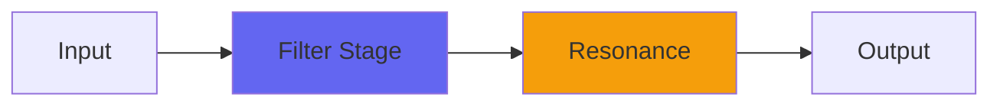

# AngleEQ

## Quick Info

| | |
|---|---|
| **Category** | Filter |
| **Type** | Filter |
| **Status** | Latest Release |

## Description

a strange and colorful EQ

## Detailed Overview

This would have been amazing, had it worked. Instead, it's astonishing, and is never going to be your main EQ, or mine, ever.

Seriously, it'd be a world of hurt, and don't do it. Not even while sandwiching it with uLaw plugins.

Since you can't use it for real work, what good is it? Also, why can't you use it for real work?

It's not just that its response is irregular and non-flat. You could deal with that. The trouble is, it's a new attempt at filtering, meant to do a super-sharp but non-resonant lowpass for a crossover.

And it does a lot of that! But in the process, it scrambles the audio so pervasively that if you try to assemble an EQ out of subtracting it from the dry signal (a neat trick for making 'flat' be pristine beyond all reason) the 'highpass' you get from subtracting the lowpass, is a complete mess full of phase-rotated bass.

So I came up with a way to get a real highpass, even with multiple stages of this filtering. And I got one, and even that is decidedly strange.

So, AngleEQ is a highpass for a treble band, a lowpass for a bass band, and a midrange that has a separate highpass and lowpass, just because they will not combine in any suitable way anyhow. Then you've got a dry/wet because combining any of these bands with dry brings even more havoc, and then the dry/wet also is an attenuverter and lets you apply the EQ inverted because it wasn't doing enough damage already.

How does it sound? Very opaque, weirdly resonant, perhaps like the largest color-style EQ on the biggest most overdesigned mixing board ever. Nothing about it is well behaved, it cannot do 'clean' to save its life, it exists only to make sonic trouble and produce strange pungent tones full of resonances and cancellations.

Just because it's not a proper EQ doesn't mean you can't have fun. Hope you enjoy AngleEQ!

## Signal Flow

## How It Works

AngleEQ shapes frequencies through EQ. Use it for tone shaping, problem solving, or creative sound design.

## Usage Tips

- Make small adjustments - EQ is powerful
- Cut first, boost second (if needed)
- Check your changes in context with the full mix
- Use solo to identify problem frequencies

## Related Plugins

Browse other [Filter](../categories/filter.md) plugins.

## Technical Details

**Source Code**: [View on GitHub](https://github.com/airwindows/airwindows/tree/master/plugins/LinuxVST/src/AngleEQ)

**Categories**: Filter

**Available Formats**:
- Mac AU
- Mac VST
- Windows VST
- Linux VST

## Resources

- [All Airwindows Plugins](../../README.md)
- [Category: Filter](../categories/filter.md)
- [Airwindows Website](https://www.airwindows.com)
- [Airwindows GitHub](https://github.com/airwindows/airwindows)

---

*Part of the Airwindows plugin collection - Open source audio processing plugins*

*Last updated: 2024*
