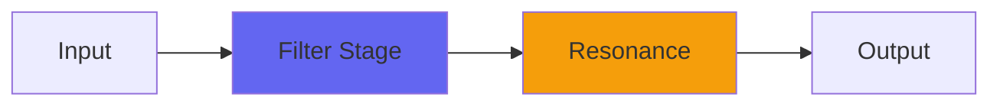

# AngleFilter

## Quick Info

| | |
|---|---|
| **Category** | Filter |
| **Type** | Filter |
| **Status** | Latest Release |

## Description

the synth-style extension of AngleEQ

## Detailed Overview

So while I do stuff like make new forms of reverb (going from 5x5 matrices to 6x6!) and try to invent genres of music, there's this funny little filter…

AngleFilter is an offshoot of AngleEQ, which was too strange by itself but ended up turning into the EQs used in PointyGuitar and ChimeyGuitar. This is probably why those can get weird when you set the controls too strangely, and AngleFilter gets even weirder. It was meant to be a nonresonant filter, just a very steep brickwall type thing, but instead it does crazy things with phase around the cutoff, and grows steeper and more intense the more you lower that cutoff.

Since it was so untameable I just put a full-on waveshaper on the output, so its excesses won't blow up to huge dB spikes. There's a Hard control, and what it does is it makes life hard for you in setting the other controls. Mostly it goes insane over lower bassy settings, but it can be set to produce a dull roar at higher frequencies too, and the whole design of the plugin is for letting you modulate the cutoff hyper-aggressively without problems.

I'm working on things like very serious reverb upgrades, but sometimes you just gotta have fun too :)

## Signal Flow

## How It Works

AngleFilter shapes frequencies through filtering. Use it for tone shaping, problem solving, or creative sound design.

## Usage Tips

- Make small adjustments - EQ is powerful
- Cut first, boost second (if needed)
- Check your changes in context with the full mix
- Use solo to identify problem frequencies

## Related Plugins

Browse other [Filter](../categories/filter.md) plugins.

## Technical Details

**Source Code**: [View on GitHub](https://github.com/airwindows/airwindows/tree/master/plugins/LinuxVST/src/AngleFilter)

**Categories**: Filter

**Available Formats**:
- Mac AU
- Mac VST
- Windows VST
- Linux VST

## Resources

- [All Airwindows Plugins](../../README.md)
- [Category: Filter](../categories/filter.md)
- [Airwindows Website](https://www.airwindows.com)
- [Airwindows GitHub](https://github.com/airwindows/airwindows)

---

*Part of the Airwindows plugin collection - Open source audio processing plugins*

*Last updated: 2024*
