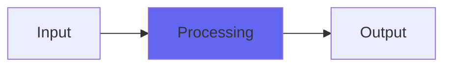

# Apicolypse

## Quick Info

| | |
|---|---|
| **Category** | Tone Color |
| **Type** | Tone Color |
| **Status** | Stable |

## Description

a re-release of my old API-style color adder, exacly as it was

## Detailed Overview

Apicolypse works the same way Neverland did. It’s a drop-in replacement for old mixes, and was a precursor to BussColors. It’s got a simpler method of generating its dynamic impulses, making them a sort of continuous spectrum between the low-level and high-level sounds. Like Neverland, it’s 44.1K though it will still function at any rate you like (sort of pitched up): like Neverland, it’s got a hardness control that at 0 is the ‘Density’ algorithm, at 1.0 is straight digital clipping at the extreme, and at any setting between is a sort of hybrid that turned out to not be the greatest: a switch from perfectly clean, to soft-clip at any desired transition point. Technically if you had it so it only kicked in on hot peaks, it’d be hard to find fault with it: I don’t recommend setting it (on this or any Character plug or ‘Crystal’) to a position where soft-clip kicks in at very low level. Either do Hardness at zero, or high enough that most of the audio stays ‘un-distorted’: you can do what you like, though, I’m not the boss of you :)

## Signal Flow

## How It Works

Apicolypse processes audio in the Tone Color category. See the description above for specific functionality.

## Usage Tips

- Start with conservative settings
- A/B compare to hear the effect clearly
- Use in context with other processing
- Trust your ears over visual meters

## Related Plugins

Browse other [Tone Color](../categories/tone-color.md) plugins.

## Technical Details

**Source Code**: [View on GitHub](https://github.com/airwindows/airwindows/tree/master/plugins/LinuxVST/src/Apicolypse)

**Categories**: Tone Color

**Available Formats**:
- Mac AU
- Mac VST
- Windows VST
- Linux VST

## Resources

- [All Airwindows Plugins](../../README.md)
- [Category: Tone Color](../categories/tone-color.md)
- [Airwindows Website](https://www.airwindows.com)
- [Airwindows GitHub](https://github.com/airwindows/airwindows)

---

*Part of the Airwindows plugin collection - Open source audio processing plugins*

*Last updated: 2024*
