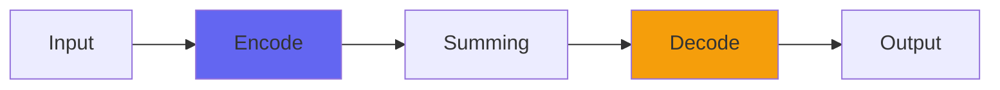

# AtmosphereChannel

## Quick Info

| | |
|---|---|
| **Category** | Consoles |
| **Type** | Consoles |
| **Status** | Stable |

## Description

Console5 processing with powerful new acoustic distance effects

## Detailed Overview

I’m pleased with this one: it’s in the Console5 family (so its parts can be interchanged with any other Console5 plugins) but it represents a few different breakthroughs, and if they work out, I’ll be keeping them.

First, this is a multi-stage slew clipper. The effect’s a bit like PDConsole, a gluing and taming of bright digital highs: but, where PDConsole uses the algorithm of PurestDrive to get a more analog mixing-desk kind of sound, Atmosphere’s many stages of slew clipping (across fourteen samples, each with a different maximum slew) enforces the behavior of free air and acoustic distance. This has been a goal for quite a while, but I’ve never got results like these before (might be worth fitting a more exaggerated version into a ‘Distance 2’, if people like). It’s not calibrated to overwhelm, but the scale of your mix should be huge, and since it’s an extended-window slew clipping effect your quieter, subtler sounds don’t get muddied.

This type of processing steps on the annoying digital harshness with a heavy foot, but doesn’t directly EQ: the results you get will depend on what it would be like to have your sound blasting away through a perfect playback system at a distance of ten to thirty feet. If you need up-close, bright and loud sounds, you’ll need to use another system (such as PurestConsole), this one is for space and scale. It’ll probably work well for some electronic mixes if they’re meant to sound loud, it’ll give a real hugeness to rock or metal mixes (so long as the desired effect is more ‘live gig’ in scale) and it will really come into its own summing orchestral stuff from virtual instruments (or anything with similar scale/power needs).

## Signal Flow

## How It Works

AtmosphereChannel is part of the Airwindows Console system. Use the Channel version on tracks and the Buss version on the master to create a unique summing environment that adds space and dimension to your mix.

## Usage Tips

- Use matching Channel and Buss plugins (don't mix versions)
- Start with settings at 0.5 (neutral)
- Place Channel on all important tracks
- Place Buss on master fader only

## Related Plugins

Browse other [Consoles](../categories/consoles.md) plugins.

## Technical Details

**Source Code**: [View on GitHub](https://github.com/airwindows/airwindows/tree/master/plugins/LinuxVST/src/AtmosphereChannel)

**Categories**: Consoles

**Available Formats**:
- Mac AU
- Mac VST
- Windows VST
- Linux VST

## Resources

- [All Airwindows Plugins](../../README.md)
- [Category: Consoles](../categories/consoles.md)
- [Airwindows Website](https://www.airwindows.com)
- [Airwindows GitHub](https://github.com/airwindows/airwindows)

---

*Part of the Airwindows plugin collection - Open source audio processing plugins*

*Last updated: 2024*
