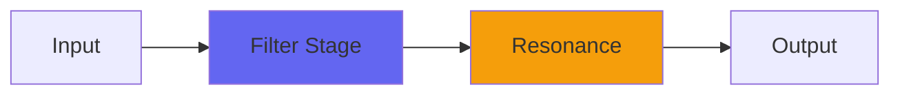

# Average

## Quick Info

| | |
|---|---|
| **Category** | Filter |
| **Type** | Filter |
| **Status** | Latest Release |

## Description

a distinctive sort of lowpass filter

## Detailed Overview

This plugin is an exploration of a fascinating filter type that, I think, is really underrated. It’s a straight-up extremely simple averaging filter. If you set it to integer values, it exactly averages that number of taps on the input audio (adjacent samples). If you pick in-between values it interpolates, causing the ‘frequency’ of the filter to smoothly blend between the values.

There’s a reason you don’t see this filter used for lowpasses: it’s not technically correct. In fact it whacks a great big cancellation node into the high frequencies, and the tone (while pleasing) is very obviously affected by this. It’s a bit of a flangey quality.

BUT, we know better than to be limited by technical concepts, right? After all, the classic Scream Tracker resonant lowpass is known to be broken, and that has a real character to it. And even the Roland Supersaw is known to have some quirks that make it what it is…

Average has a fantastic tonality once you accept the response quirks. You can dial in the notches to suppress unwanted content, and (in a post-video revision) it’s got a dry-wet control so you can moderate the effect—and, typically for Airwindows, if this dry/wet is set to full wet, the calculations for doing that drop out of the plugin entirely so you’re not doing an unnecessary multiply.

## Signal Flow

## How It Works

Average shapes frequencies through filtering. Use it for tone shaping, problem solving, or creative sound design.

## Usage Tips

- Make small adjustments - EQ is powerful
- Cut first, boost second (if needed)
- Check your changes in context with the full mix
- Use solo to identify problem frequencies

## Related Plugins

Browse other [Filter](../categories/filter.md) plugins.

## Technical Details

**Source Code**: [View on GitHub](https://github.com/airwindows/airwindows/tree/master/plugins/LinuxVST/src/Average)

**Categories**: Filter

**Available Formats**:
- Mac AU
- Mac VST
- Windows VST
- Linux VST

## Resources

- [All Airwindows Plugins](../../README.md)
- [Category: Filter](../categories/filter.md)
- [Airwindows Website](https://www.airwindows.com)
- [Airwindows GitHub](https://github.com/airwindows/airwindows)

---

*Part of the Airwindows plugin collection - Open source audio processing plugins*

*Last updated: 2024*
