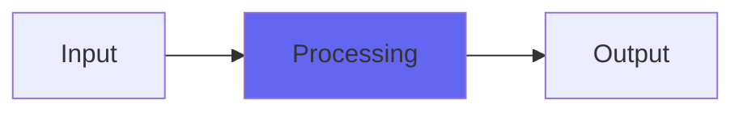

# BassKit

## Quick Info

| | |
|---|---|
| **Category** | Bass |
| **Type** | Bass |
| **Status** | Latest Release |

## Description

centered bass reinforcement with subs fill. Clean and controllable

## Detailed Overview

This is much like DubSub or DubCenter, except it’s strictly mono bass and is designed to be super controllable. The controls are simplified and kind of optimized so only good-sounding results come out. You need to have good subwoofers (or use SubsOnly to test) to use the Sub output, otherwise you may not be able to hear what you’re doing as it’s much deeper and more filtered than you get with most DubSub patches (the filters are somewhat rearranged).

The Bass reinforcement works like if you were using the head bump in ToTape, except it’s mono-only so it will only reinforce usefully. Because BassKit is meant for mastering and 2-buss duties, and not the full range of madness available in DubSub/DubCenter, it uses the bass and sub augmentation ONLY as additions to dry: never ‘wet only’. You can exaggerate it, but the intention is to make it easy to add bass and subs in a sensible, controlled way. I hope it proves useful, and I know it will be more well-behaved than DubSub in case that one was too unmanageable for normal use :)

## Signal Flow

## How It Works

BassKit processes audio in the Bass category. See the description above for specific functionality.

## Usage Tips

- Start with conservative settings
- A/B compare to hear the effect clearly
- Use in context with other processing
- Trust your ears over visual meters

## Related Plugins

Browse other [Bass](../categories/bass.md) plugins.

## Technical Details

**Source Code**: [View on GitHub](https://github.com/airwindows/airwindows/tree/master/plugins/LinuxVST/src/BassKit)

**Categories**: Bass

**Available Formats**:
- Mac AU
- Mac VST
- Windows VST
- Linux VST

## Resources

- [All Airwindows Plugins](../../README.md)
- [Category: Bass](../categories/bass.md)
- [Airwindows Website](https://www.airwindows.com)
- [Airwindows GitHub](https://github.com/airwindows/airwindows)

---

*Part of the Airwindows plugin collection - Open source audio processing plugins*

*Last updated: 2024*
