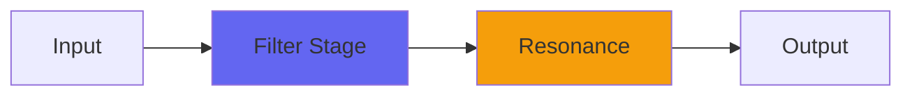

# Baxandall

## Quick Info

| | |
|---|---|
| **Category** | Filter |
| **Type** | Filter |
| **Status** | Stable |

## Description

a killer general-purpose EQ

## Detailed Overview

Baxandall starts with a two-band filter that, zeroed out, subtracts an inverse lowpass from a lowpass and gives you bit-identical, perfectly transparent sound. That’s if you’re being subtle. If you boost or cut, lows or highs, it gives you the gentle broad boosts you expect, centered on the vital midrange. As you get more intense with the boosting, it gets more extreme, to where if you’re doing double boosts to get an intense exaggerated sound, a mids notch will naturally develop to accentuate the boosting. The whole voicing shifts to accomodate what you want to do with it, and you can play bass against treble or vice versa to get really wild voicings, such as for extreme EQ treatments (in terms of lows or highs)… but using the same natural Airwindows Baxandall tonality, so it won’t sound ‘filtery’, it’ll sound like it was meant to be that way.

Airwindows Baxandall uses my interleaved biquad filters (original, purest form, not meant for rapid automation) that run inside a Console5 instance to deepen the sound of the filter.

## Signal Flow

## How It Works

Baxandall shapes frequencies through filtering. Use it for tone shaping, problem solving, or creative sound design.

## Usage Tips

- Make small adjustments - EQ is powerful
- Cut first, boost second (if needed)
- Check your changes in context with the full mix
- Use solo to identify problem frequencies

## Related Plugins

Browse other [Filter](../categories/filter.md) plugins.

## Technical Details

**Source Code**: [View on GitHub](https://github.com/airwindows/airwindows/tree/master/plugins/LinuxVST/src/Baxandall)

**Categories**: Filter

**Available Formats**:
- Mac AU
- Mac VST
- Windows VST
- Linux VST

## Resources

- [All Airwindows Plugins](../../README.md)
- [Category: Filter](../categories/filter.md)
- [Airwindows Website](https://www.airwindows.com)
- [Airwindows GitHub](https://github.com/airwindows/airwindows)

---

*Part of the Airwindows plugin collection - Open source audio processing plugins*

*Last updated: 2024*
