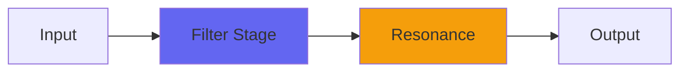

# Baxandall2

## Quick Info

| | |
|---|---|
| **Category** | Filter |
| **Type** | Filter |
| **Status** | Latest Release |

## Description

Baxandall, extended and made more powerful

## Detailed Overview

Sometimes the only way you can make something bigger is to strip it down. I'd been exploring EQs for the purposes of putting one in a future Console version, and revisited Baxandall… well, by the time I was done, a lot was different and a lot was still the same. It still uses my interleaved biquad filters (an unusual choice that helps the shallowness of the filter slopes in this very 'broad strokes' EQ). It still uses the technique of sweeping those filter center points to make increasingly extreme effects as you get crazier with it: it gets almost synth-like, starting with general 'tilt EQ' effects of great subtlety but bringing in wild boosts as you crank it. The purpose of that is to do the sort of anti-Soothe thing I favor: if you have a track and it's carrying highs, in no way do you need to also have full bass on it. Instead, you build a mix out of composite parts each of which bring a different voicing to the mix. And Baxandall2 is designed to get you to whatever broad EQ place you need, from a place of naturalness.

But there's nothing natural about the cranked-up 24dB boosts and cuts you can now do. This is newly tuned with the filter sweeping to take you straight past the original Baxandall's settings into wild new places. Also, the original Baxandall was made more forgiving by running it inside an internal Console processing, analog-ifying it. But it turns out that I can leave that to actual Console versions and strip Baxandall2 down to the guts of it, which actually gave it a lot more power.

This is Baxandall in the form that I will need it, for doing things with. But since it's Airwindows, you can use it too. And you can still use the original Baxandall, that's not going anywhere and has its own merits. Baxandall2 is just… more, at any cost, no holds barred. Hope you like it.

## Signal Flow

## How It Works

Baxandall2 shapes frequencies through filtering. Use it for tone shaping, problem solving, or creative sound design.

## Usage Tips

- Make small adjustments - EQ is powerful
- Cut first, boost second (if needed)
- Check your changes in context with the full mix
- Use solo to identify problem frequencies

## Related Plugins

Browse other [Filter](../categories/filter.md) plugins.

## Technical Details

**Source Code**: [View on GitHub](https://github.com/airwindows/airwindows/tree/master/plugins/LinuxVST/src/Baxandall2)

**Categories**: Filter

**Available Formats**:
- Mac AU
- Mac VST
- Windows VST
- Linux VST

## Resources

- [All Airwindows Plugins](../../README.md)
- [Category: Filter](../categories/filter.md)
- [Airwindows Website](https://www.airwindows.com)
- [Airwindows GitHub](https://github.com/airwindows/airwindows)

---

*Part of the Airwindows plugin collection - Open source audio processing plugins*

*Last updated: 2024*
