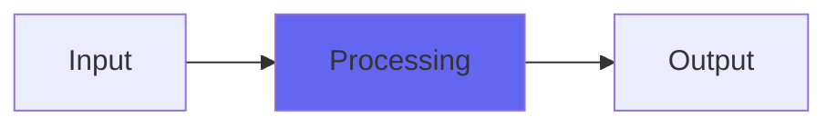

# Beam

## Quick Info

| | |
|---|---|
| **Category** | Dithers |
| **Type** | Dithers |
| **Status** | Stable |

## Description

a wordlength reducer that tries to heighten sonority

## Detailed Overview

Beam’s a wordlength reducer like Dark, but instead of seeking to always give you the least departure from whatever trajectory the audio’s on (like Dark: and that suppresses highs, including noise in the highs), Beam seeks to make all waveforms converge on the same angle (either ascending, or descending). Imagine a world of triangle-waves, the deepest frequencies taking the most energy, and progressively quieter until high frequencies are in balance with the lows. That’s Beam. Beam has a ‘focus’ control that sort of optimizes the frequency range it’s providing a window into (as in, lower settings SEEM to encourage focus on deeper sounds, higher settings SEEMS to highlight the treble, and the 0.5 is set to zero in on where our hearing’s most sensitive.) And it uses those frequencies, across a broad range of possible sounds, to emphasize the energy and depth of the audio to shocking effect.

Except, it’s not. It doesn’t know what a frequency is. It’s only ‘dithering’ in such a way as to try and accentuate certain waveform slope angles, and has no real power to do even that beyond statistical averaging of a bunch of samples.

On top of that, its noise floor is WEIRD. Dark gates into silence, sort of well-behavedly. Normal dithers become noise seamlessly. Beam goes nuts and screams, and the only thing I can say for it is, raw truncation is worse. It’s super weird… and yet, even while it’s doing that, the background audio retains a startling depth and personality. Or at least so it seems… even more than Dark, with this one you turn up DeRez and nothing happens to the sound at all. You don’t even hear the noise until it’s silly loud. (there will be a series of dither reissues with DeRez, both for auditioning and for lo-fi duties.) It might even be a ‘sonic maximizer’, putting tone qualities into the audio that weren’t there to begin with.

I admit I don’t know what to make of this at all. I know how I got it, and I know it’s doing what I made it to do. But nobody knows what you get if you sculpt audio, not by frequencies or loudness, but by reinforcing certain waveform slope angles, because to my knowledge nobody has ever wanted to do that or had a way to make it happen, even in subtle ways like this. And now that I’ve done it, I’m not certain it’s better than Dark. I understand what Dark’s doing, and why that’s useful. This is a wilder beast. Looking forward to getting people’s reactions… because one of these may replace NJAD in my flagship Airwindows plugin, Monitoring. (followup: turns out it is Dark in Monitoring2)

## Signal Flow

## How It Works

Beam processes audio in the Dithers category. See the description above for specific functionality.

## Usage Tips

- Start with conservative settings
- A/B compare to hear the effect clearly
- Use in context with other processing
- Trust your ears over visual meters

## Related Plugins

Browse other [Dithers](../categories/dithers.md) plugins.

## Technical Details

**Source Code**: [View on GitHub](https://github.com/airwindows/airwindows/tree/master/plugins/LinuxVST/src/Beam)

**Categories**: Dithers

**Available Formats**:
- Mac AU
- Mac VST
- Windows VST
- Linux VST

## Resources

- [All Airwindows Plugins](../../README.md)
- [Category: Dithers](../categories/dithers.md)
- [Airwindows Website](https://www.airwindows.com)
- [Airwindows GitHub](https://github.com/airwindows/airwindows)

---

*Part of the Airwindows plugin collection - Open source audio processing plugins*

*Last updated: 2024*
