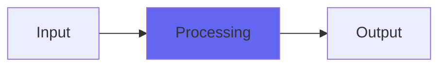

# Biquad2

## Quick Info

| | |
|---|---|
| **Category** | Biquads |
| **Type** | Biquads |
| **Status** | Stable |

## Description

the Airwindows biquad filter that's more sweepable and synthy

## Detailed Overview

This time, it’s time for the impossible!

As in, there was a reason nobody was doing sweepable, ‘synthy’ biquad filters…

Turns out it simply doesn’t work. One uses a different type, like state variable filters, for the synthy stuff. The reason is that, while biquads can sound pretty great (especially implemented like I do ’em), they fundamentally can’t cope with changing the filter coefficients mid-calculation. They flip out: you’ll hear some of that, especially at the frequency extremes. Low Q makes low frequency motions flip out, and high Q (and boy do I have a high Q for you this time) makes ultra-high frequency motions flip out in a really wild. glitchy way.

So obviously I gave up.

:D

nope! Instead, I just kind of forced the filter into zones where it mostly is controllable. This is partly through REALLY smoothing the filter cutoff, especially at low Q and low frequencies. If you try and update biquad coefficients every sample (and I already changed the form from the more CPU-efficient to the more stable form: didn’t help much at all) the algorithm gets super twitchy, so part of what I’ve done is just stabilizing things. I tried for ages to come up with some bizarre hack to force the filter back into stability: no dice. So, the range has been limited a little, the Q doesn’t adjust below a Q of 1, and it reacts really slowly, because that was the only way I could get it to behave at all. (the original Biquad can sometimes be better behaved, because it’s only recalculating coefficients every new buffer. So, zipper noise. When you get rid of that your troubles get infinitely worse, with biquads)

I’ve also got the resonance (on low and highpass) working differently. I’m scaling back loudness, but I’m also applying a distortion, then averaging after that, to try and get an ‘overdriving filter effect’ not present in the purer original Biquad. You can go quieter into Biquad2 and avoid this, or not use as much resonance: I feel it’s kind of like the Roland Alpha Juno filter resonance distortion, not an everyday thing but when it pops up it has its own distinct quality that’s interesting.

Anyway here’s Biquad2 ;)

## Signal Flow

## How It Works

Biquad2 processes audio in the Biquads category. See the description above for specific functionality.

## Usage Tips

- Start with conservative settings
- A/B compare to hear the effect clearly
- Use in context with other processing
- Trust your ears over visual meters

## Related Plugins

Browse other [Biquads](../categories/biquads.md) plugins.

## Technical Details

**Source Code**: [View on GitHub](https://github.com/airwindows/airwindows/tree/master/plugins/LinuxVST/src/Biquad2)

**Categories**: Biquads

**Available Formats**:
- Mac AU
- Mac VST
- Windows VST
- Linux VST

## Resources

- [All Airwindows Plugins](../../README.md)
- [Category: Biquads](../categories/biquads.md)
- [Airwindows Website](https://www.airwindows.com)
- [Airwindows GitHub](https://github.com/airwindows/airwindows)

---

*Part of the Airwindows plugin collection - Open source audio processing plugins*

*Last updated: 2024*
