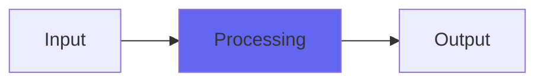

# BiquadHiLo

## Quick Info

| | |
|---|---|
| **Category** | Biquads |
| **Type** | Biquads |
| **Status** | Stable |

## Description

the highpass and lowpass filter in ConsoleX

## Detailed Overview

Pretty straightforward: this is effectively the same thing as the highpass and lowpass used in ConsoleX. Except, in practice it's absolutely not, because in ConsoleX both of these are distributed filters. That means as signal hits the Stonefire section with dynamics, it will have hit some of the highpassing and lowpassing, but not all of it: some of it will happen after the dynamics. Some of it will happen after the four-band parametric EQ, which is somewhat nonlinear. The lowpass in particular gets to work as a distributed filter against aliasing, especially if you're running at high sample rate.

But here it's just those filters as a one-piece unit.

That also means you can use it as those filters, but in a much more lightweight form than in ConsoleX. I'm hoping ConsoleX is working out for people (it will be a while before I'm finished explaining all that, and getting it working on everybody's DAW, if that's even possible!). But though it is prettier and a lot fancier, it's way more complicated.

In the video I made, I demonstrate how you might be running something like a guitar into virtual tape (ToTape8 in this case) and from there into ConsoleX. But there are some things you simply can't do when processing the sound AFTER the tape. Sometimes there's a reason to shape the sound going in front of the tape, so it can hit those harmonics harder with less extra frequencies flying around… and BiquadHiLo can work for 'trapping in' a sound like that so it can hit tape even harder and produce a really direct, clear sound.

And of course you can use ConsoleXPre for exactly that purpose and have all the EQs or even dynamics going, both in front of and after the tape, but much like you have access to three bands of the parametric EQ in 'Parametric', and have the dynamics in 'StoneFireComp', you have the additional filters in BiquadHiLo.

If all goes well I can have the 'mastering' (a very airwindowsized take on mastering) plugin by next week, but while I work on more fixes for ConsoleX, here's a spare filter to have :)

## Signal Flow

## How It Works

BiquadHiLo processes audio in the Biquads category. See the description above for specific functionality.

## Usage Tips

- Start with conservative settings
- A/B compare to hear the effect clearly
- Use in context with other processing
- Trust your ears over visual meters

## Related Plugins

Browse other [Biquads](../categories/biquads.md) plugins.

## Technical Details

**Source Code**: [View on GitHub](https://github.com/airwindows/airwindows/tree/master/plugins/LinuxVST/src/BiquadHiLo)

**Categories**: Biquads

**Available Formats**:
- Mac AU
- Mac VST
- Windows VST
- Linux VST

## Resources

- [All Airwindows Plugins](../../README.md)
- [Category: Biquads](../categories/biquads.md)
- [Airwindows Website](https://www.airwindows.com)
- [Airwindows GitHub](https://github.com/airwindows/airwindows)

---

*Part of the Airwindows plugin collection - Open source audio processing plugins*

*Last updated: 2024*
