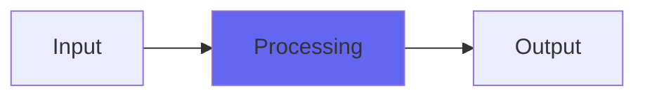

# BrightAmbience

## Quick Info

| | |
|---|---|
| **Category** | Ambience |
| **Type** | Ambience |
| **Status** | Stable |

## Description

a plugin for very bright gated reverbs

## Detailed Overview

BrightAmbience is one of the old secret weapons of classic Airwindows. It’s nasty enough to be pretty unique, and nice enough to be useable. What it does, is it sets up a BIG pile of delay taps spaced by prime numbers. There’s a decay control and a sustain control: the sustain will help with its CPU hungriness, the decay won’t. Dry/wet is at the top (what can I say, this was an early one) and wet tends to run HOT so you might like to use it as mostly dry and add its coloration to things as needed.

It’s CPU hungry because it’s using a really naive method of doing all that, but it also has a really distinct sound that differs from what you can get out of convolution reverbs. And since the distribution of delay taps is prime-numbered but also kind of naive, instead of getting a convincing room you get a sort of steel-chamber effect with a nasty resonance up near the Nyquist frequency. But that can work as a special effect. Back in the day I meant this to be a great reverb, but it’s not. However, it IS a great ‘crazy bright ambience effect’, though it’s pretty CPU hungry like I said. You can apply it to anything that you’d like a halo of shiny around, and its tone is nicer at 96K as I demo it. (the sustain is tied to maximum sample delay, so higher sample rates will give you shorter sustains and denser shininess)

## Signal Flow

## How It Works

BrightAmbience processes audio in the Ambience category. See the description above for specific functionality.

## Usage Tips

- Start with conservative settings
- A/B compare to hear the effect clearly
- Use in context with other processing
- Trust your ears over visual meters

## Related Plugins

Browse other [Ambience](../categories/ambience.md) plugins.

## Technical Details

**Source Code**: [View on GitHub](https://github.com/airwindows/airwindows/tree/master/plugins/LinuxVST/src/BrightAmbience)

**Categories**: Ambience

**Available Formats**:
- Mac AU
- Mac VST
- Windows VST
- Linux VST

## Resources

- [All Airwindows Plugins](../../README.md)
- [Category: Ambience](../categories/ambience.md)
- [Airwindows Website](https://www.airwindows.com)
- [Airwindows GitHub](https://github.com/airwindows/airwindows)

---

*Part of the Airwindows plugin collection - Open source audio processing plugins*

*Last updated: 2024*
