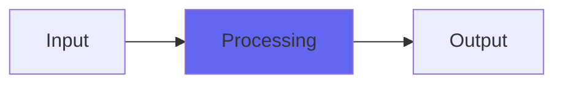

# BussColors4

## Quick Info

| | |
|---|---|
| **Category** | Tone Color |
| **Type** | Tone Color |
| **Status** | Latest Release |

## Description

the Airwindows console emulations, now working up to 192K correctly

## Detailed Overview

This plugin’s a pretty huge deal: it’s been around since before console emulations were a thing, and I’ve been steadily working on it year after year. There’s not been much to do: my original algorithms, once I moved past the earliest incarnation as the ‘Character’ plugins, were so solid that it left little to do. BussColors has sold $22,445 of plugins over the years, as Audio Units alone, in spite of the fact that it has always been a 44.1K plug (due to being based on a convolution model).

The story there is, a guy at NoiseVault always wanted someone to make a plugin which used his sets of hardware convolution kernels, which he’d done at all different levels. Sort of the Nebula thing (Giancarlo has been a great help when I was getting the VST thing going, check out Nebula)

I’m not that. I’m Chris from Airwindows… so I set out to make my own version of this sort of thing, with hardcoded algorithms generated on-the-fly, as raw and close to the metal as I could get it. And I got some pretty respectable CPU efficiency with all of the tone quality I wanted, limited to 44.1K.

UNTIL NOW :)

Try it. BussColors4 is the newest version of BussColors, and it works at any sample rate and gets you the same sound. Better, in fact: I like what it does a lot better at 96K and 192K. It also doesn’t greatly expand processing and CPU hit at higher sample rates. I think this one’s a real highlight of the Airwindows arsenal. It would definitely be worth your $50, like its predecessors (well, I always did give existing BussColors users free updates for life, I mean for new buyers). Feel free to shoot it out against the most expensive and/or CPU-hungry options and I think it will clobber all comers.

The sources of the models in BussColors are as follows: 

Dark (originally Cider) is a Focusrite and resembles an MCI console a bit
Rock (also seen in the Logical compressor) is from SSL impulses, obviously it's SSL in nature
Lush (originally Neverland) is from Neve impulses
Vibe (originally in the Elation compressor) is from LA-2A impulses
Holo (originally in Precious) is from Precision8 impulses
Punch (originally in APIcolypse) is from API impulses
Steel (originally in Calibre) is something else, I don't remember what
Tube (originally Luxor) is from Manley Massive Passive impulses

All of these run a form of dynamic convolution which means they are never EXACTLY what the source impulses would have them be: it's more complicated than that. So, treat them as original things, not as attempts to clone whatever original gear sourced the impulses. In the end, they're BussColors(4).

## Signal Flow

## How It Works

BussColors4 processes audio in the Tone Color category. See the description above for specific functionality.

## Usage Tips

- Start with conservative settings
- A/B compare to hear the effect clearly
- Use in context with other processing
- Trust your ears over visual meters

## Related Plugins

Browse other [Tone Color](../categories/tone-color.md) plugins.

## Technical Details

**Source Code**: [View on GitHub](https://github.com/airwindows/airwindows/tree/master/plugins/LinuxVST/src/BussColors4)

**Categories**: Tone Color

**Available Formats**:
- Mac AU
- Mac VST
- Windows VST
- Linux VST

## Resources

- [All Airwindows Plugins](../../README.md)
- [Category: Tone Color](../categories/tone-color.md)
- [Airwindows Website](https://www.airwindows.com)
- [Airwindows GitHub](https://github.com/airwindows/airwindows)

---

*Part of the Airwindows plugin collection - Open source audio processing plugins*

*Last updated: 2024*
