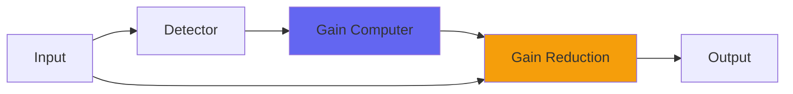

# ButterComp2

## Quick Info

| | |
|---|---|
| **Category** | Dynamics |
| **Type** | Dynamics |
| **Status** | Latest Release |

## Description

improved ButterComp with an output control and sound upgrades

## Detailed Overview

So here’s what happened: in working on the new ButterComp, I found a mistake. Because of a thing C programming lets you do (assign, in an if statement) it turned out the original ButterComp didn’t actually use the interleaved compressors after all. The one in CStrip does, but actual ButterComp (which has its own distinct fans!) doesn’t. It’s strictly a bi-polar compressor: it does each half of the wave different, and blends them.

Because of this, I’ve made the source code (also being released) represent what the plugin actually does in practice. It’s a little simplified, and it’s worth paying attention to, for people who like the simplest most minimal form of ButterComp.

But, because of this, I get to release ButterComp2 as very much its own thing! I even came up with a subtle tweak: it modifies its release just a touch, slowing it when the signal’s hot. That’s on a sample-by-sample basis… and it’s on the OUTPUT of the compressor. So, this further smoothing effect is subject to the output level control. And the dry/wet. In fact if you had it all dry, the release modification is therefore as if you had it on the input… making it blend not only between positive and negative wave compression, but also between feedback and feed-forward release time modifications :)

But really what you need to do is listen to it.

With the interleaved compressors fully working AND the bi-polar compression on each, there is indeed the four distinct compressors working in parallel. The whole thing is very gentle (hence the name) but you’ll get a glue and tonal reshaping out of it as it will even out the bulk of the waveform, making it balanced between positive and negative. It’ll also soak up treble detail in a characteristic way, and you’ll really hear the quality of ButterComp2 on ambiences and reverb tails. It’ll float things in space in this holographic way… I thought it made for a significant tonal improvement over the simpler ButterComp.

## Signal Flow

## How It Works

ButterComp2 controls dynamics through compression. The algorithm responds to your audio in a musical way, providing transparent to aggressive dynamic control.

## Usage Tips

- Start with gentle settings and increase as needed
- Use Dry/Wet for parallel compression if available
- Listen for pumping or artifacts
- A/B bypass to check if processing helps the mix

## Related Plugins

Browse other [Dynamics](../categories/dynamics.md) plugins.

## Technical Details

**Source Code**: [View on GitHub](https://github.com/airwindows/airwindows/tree/master/plugins/LinuxVST/src/ButterComp2)

**Categories**: Dynamics

**Available Formats**:
- Mac AU
- Mac VST
- Windows VST
- Linux VST

## Resources

- [All Airwindows Plugins](../../README.md)
- [Category: Dynamics](../categories/dynamics.md)
- [Airwindows Website](https://www.airwindows.com)
- [Airwindows GitHub](https://github.com/airwindows/airwindows)

---

*Part of the Airwindows plugin collection - Open source audio processing plugins*

*Last updated: 2024*
