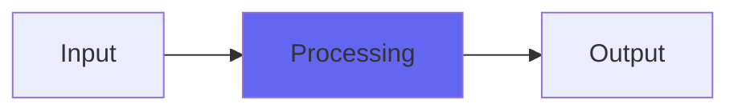

# Calibre

## Quick Info

| | |
|---|---|
| **Category** | Tone Color |
| **Type** | Tone Color |
| **Status** | Stable |

## Description

a re-release of another old Character plugin

## Detailed Overview

Calibre is another Character plugin, re-released in AU and VST form. This one’s got kind of a steely quality and if you hype the Character control there’s a point where bass cancels out: weird variation on a tone control! Also, that means if you duplicated the track (or used Blue Cat Patchwork or something) and flipped phase, you’d get a really unusual lowpass and would have only the bass and a lot of strange color.

## Signal Flow

## How It Works

Calibre processes audio in the Tone Color category. See the description above for specific functionality.

## Usage Tips

- Start with conservative settings
- A/B compare to hear the effect clearly
- Use in context with other processing
- Trust your ears over visual meters

## Related Plugins

Browse other [Tone Color](../categories/tone-color.md) plugins.

## Technical Details

**Source Code**: [View on GitHub](https://github.com/airwindows/airwindows/tree/master/plugins/LinuxVST/src/Calibre)

**Categories**: Tone Color

**Available Formats**:
- Mac AU
- Mac VST
- Windows VST
- Linux VST

## Resources

- [All Airwindows Plugins](../../README.md)
- [Category: Tone Color](../categories/tone-color.md)
- [Airwindows Website](https://www.airwindows.com)
- [Airwindows GitHub](https://github.com/airwindows/airwindows)

---

*Part of the Airwindows plugin collection - Open source audio processing plugins*

*Last updated: 2024*
