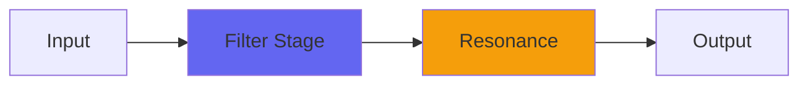

# Capacitor2

## Quick Info

| | |
|---|---|
| **Category** | Filter |
| **Type** | Filter |
| **Status** | Latest Release |

## Description

Capacitor with extra analog modeling and mojo

## Detailed Overview

Didn’t see this coming!

My researches led me to a webpage by the electronics company Murata, and an observation: for a particular line of capacitors they make, namely high dielectric ceramic caps made of barium titanate, there’s a concern. The capacitance drops sharply if you put the capacitor under voltage pressure. How much? As much as 50% for a little over six volts. It’s pretty linear. Thing is, the signal is ALSO a voltage. What if it tended to modulate the cutoff? As part of analog modeling?

I have plugins, the old Lowpass and Highpass, which frequency-modulate the cutoff based on the input signal. But they did it symmetrically… what about doing it the way the real-world capacitor would do it? What would you get, in the event that other capacitors had some of this behavior? It seemed like you might get a lot of even harmonics, and people tend to like that. Why not give it a try?

And that’s how something interesting got discovered.

Capacitor2 is Capacitor, already a popular plugin, but with this analog modeling built in. There’s a ‘NonLin’ control that lets you crank up the distortedness from very minimal, to quite extreme. It’s sensitive to input level (naturally) so that’s another reason to have it on a control.

And what you get is INTENSE analog coloration, and something unexpected: it emphasizes transients and brings out the articulateness of sounds in a really distinctive way. You may not have heard anything quite like this… or if you’ve been using analog gear, maybe you’re used to hearing it. I really didn’t plan for the result I got: if real-world caps have any of this behavior, it explains a lot. Literally all that’s happening is modulating the cutoff frequency of the rather Airwindows-y Capacitor algorithm. There’s no dynamics processing in there at all, but the result is incredibly dynamic. (you can even use it to boost narrow bandpasses for effect!)

## Signal Flow

## How It Works

Capacitor2 shapes frequencies through filtering. Use it for tone shaping, problem solving, or creative sound design.

## Usage Tips

- Make small adjustments - EQ is powerful
- Cut first, boost second (if needed)
- Check your changes in context with the full mix
- Use solo to identify problem frequencies

## Related Plugins

Browse other [Filter](../categories/filter.md) plugins.

## Technical Details

**Source Code**: [View on GitHub](https://github.com/airwindows/airwindows/tree/master/plugins/LinuxVST/src/Capacitor2)

**Categories**: Filter

**Available Formats**:
- Mac AU
- Mac VST
- Windows VST
- Linux VST

## Resources

- [All Airwindows Plugins](../../README.md)
- [Category: Filter](../categories/filter.md)
- [Airwindows Website](https://www.airwindows.com)
- [Airwindows GitHub](https://github.com/airwindows/airwindows)

---

*Part of the Airwindows plugin collection - Open source audio processing plugins*

*Last updated: 2024*
