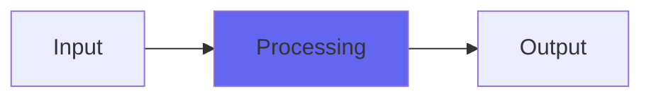

# Channel4

## Quick Info

| | |
|---|---|
| **Category** | Tone Color |
| **Type** | Tone Color |
| **Status** | Stable |

## Description

a tone coloring plugin that gives more of an analog feel

## Detailed Overview

Channel4 uses a very good-sounding saturation function, a calibrated slew clipper and a highpass to approximate the tone coloration of a recording console. (the plugin Console4 approximates the space and depth on the mix buss, which is different.) Because the bandwidth-limiters are set up based on measurements of real gear (through impulse responses), Channel4’s console type is labeled ‘Neve/API/SSL’. It doesn’t actually contain any of those things or any convolution kernels, but the presentation of the sound ought to suggest those voicings.

There’s also an argument for doing it that way, because in many cases you can’t hear those limitations unless they’re being way overloaded. Channel’s a very clean, pure ‘coloration’ plugin, especially with the drive kept at 50% or under. It’ll voice extreme sounds the way it’s labeled, but you would struggle to consistently set plugins like Slew to those targets because mostly you can’t hear what it’s doing, especially on normal/musical sounds.

## Signal Flow

## How It Works

Channel4 processes audio in the Tone Color category. See the description above for specific functionality.

## Usage Tips

- Start with conservative settings
- A/B compare to hear the effect clearly
- Use in context with other processing
- Trust your ears over visual meters

## Related Plugins

Browse other [Tone Color](../categories/tone-color.md) plugins.

## Technical Details

**Source Code**: [View on GitHub](https://github.com/airwindows/airwindows/tree/master/plugins/LinuxVST/src/Channel4)

**Categories**: Tone Color

**Available Formats**:
- Mac AU
- Mac VST
- Windows VST
- Linux VST

## Resources

- [All Airwindows Plugins](../../README.md)
- [Category: Tone Color](../categories/tone-color.md)
- [Airwindows Website](https://www.airwindows.com)
- [Airwindows GitHub](https://github.com/airwindows/airwindows)

---

*Part of the Airwindows plugin collection - Open source audio processing plugins*

*Last updated: 2024*
