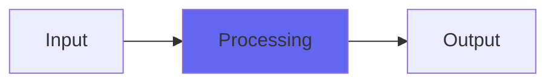

# Channel8

## Quick Info

| | |
|---|---|
| **Category** | Tone Color |
| **Type** | Tone Color |
| **Status** | Stable |

## Description

Channel7 with updates from Capacitor2 and Slew3. More and better of what Channel is

## Detailed Overview

Channel8 is a subtle ‘analogifier’ that applies saturation boosts, subtle highpass filtering, and slew clipping. What that means is, there’s a ‘drive’ knob you can turn up to boost things, and you can pick three ‘flavors’ you might recognize. They’re not really the consoles associated with those things, but they are calibrated to take effect about the same way, and when you use Channel8 (on tracks, on the mix buss, wherever) you add a little ‘analog flavor’ by restricting what the audio can do, in ways that are characteristic of real analog gear’s limitations. This restricting can help make things sound bigger and more solid.

This is basically the newest evolution of Channel, which has always been one of my most popular plugins. It uses the improvements in Capacitor2 and Slew3, so basically it’s still relatively subtle, still very much Channel, but it’s taken on a new level in quality and natural tone. I’m real happy with it, and I’ll be returning to trying to fix up my video setup etc (and finishing up the dither re-releases, etc etc) knowing that I’ve dropped a nice audio bomb on the world. If you ever liked Channel, this should make you real happy.

## Signal Flow

## How It Works

Channel8 processes audio in the Tone Color category. See the description above for specific functionality.

## Usage Tips

- Start with conservative settings
- A/B compare to hear the effect clearly
- Use in context with other processing
- Trust your ears over visual meters

## Related Plugins

Browse other [Tone Color](../categories/tone-color.md) plugins.

## Technical Details

**Source Code**: [View on GitHub](https://github.com/airwindows/airwindows/tree/master/plugins/LinuxVST/src/Channel8)

**Categories**: Tone Color

**Available Formats**:
- Mac AU
- Mac VST
- Windows VST
- Linux VST

## Resources

- [All Airwindows Plugins](../../README.md)
- [Category: Tone Color](../categories/tone-color.md)
- [Airwindows Website](https://www.airwindows.com)
- [Airwindows GitHub](https://github.com/airwindows/airwindows)

---

*Part of the Airwindows plugin collection - Open source audio processing plugins*

*Last updated: 2024*
