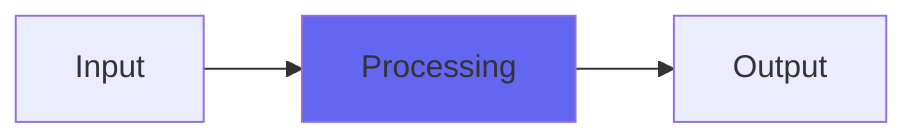

# ChromeOxide

## Quick Info

| | |
|---|---|
| **Category** | Lo-Fi |
| **Type** | Lo-Fi |
| **Status** | Latest Release |

## Description

an alternate path to vibey old tape sonics

## Detailed Overview

Chrome Oxide was an experiment, one that didn’t go further than this. It is a dual-band tape emulation, where the lows are a bit saturated but the highs are delayed by a random noise warble that can also be biased to delay them a bit further. My pursuits of tape emulation have always gone toward the ‘BETTER than digital’ direction, where I tried to capture the magic without diving into the audio degradation.

But revisiting Chrome Oxide (and re-releasing it, with modern wordlength handling etc and dithering to the floating point output buss) showed me a plugin that excels at some tonalities I didn’t even know about when I made it. For instance, your Boards of Canada type stuff, mulch-core audio where it sounds like it’s coming off an old Walkman or Wollensack? This will not do crazy pitch wobbles or dropouts… but you can instantly, effortlessly get the tone of it. The intensity controls a noise effect that is FM, frequency modulating the highs against the lows. Bias further delays the highs, and this sculpts the phase aberrations of the output and the flavor of roll-off… so, without ever getting aggressive or obvious, you can just dial-a-mulch and go as fuzzy and old-sounding as you like, but musically. It is subtle enough to use on anything and aggressive enough to completely change the mood of a track.

And now you can have it. Mulch away! You don’t have to obliterate a track to get into the vibe you crave. (and of course some people hate this sort of thing: if you doubly hate this one, I’ll know I’ve done it right :D )

## Signal Flow

## How It Works

ChromeOxide processes audio in the Lo-Fi category. See the description above for specific functionality.

## Usage Tips

- Start with conservative settings
- A/B compare to hear the effect clearly
- Use in context with other processing
- Trust your ears over visual meters

## Related Plugins

Browse other [Lo-Fi](../categories/lo-fi.md) plugins.

## Technical Details

**Source Code**: [View on GitHub](https://github.com/airwindows/airwindows/tree/master/plugins/LinuxVST/src/ChromeOxide)

**Categories**: Lo-Fi

**Available Formats**:
- Mac AU
- Mac VST
- Windows VST
- Linux VST

## Resources

- [All Airwindows Plugins](../../README.md)
- [Category: Lo-Fi](../categories/lo-fi.md)
- [Airwindows Website](https://www.airwindows.com)
- [Airwindows GitHub](https://github.com/airwindows/airwindows)

---

*Part of the Airwindows plugin collection - Open source audio processing plugins*

*Last updated: 2024*
