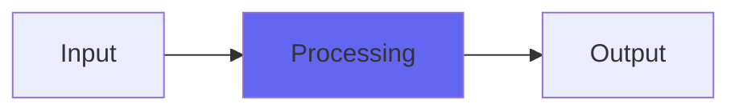

# ClipOnly

## Quick Info

| | |
|---|---|
| **Category** | Clipping |
| **Type** | Clipping |
| **Status** | Stable |

## Description

a clipper plugin that suppresses the brightness of digital clipping without affecting unclipped samples

## Detailed Overview

Here’s what I’ve done. I started with Clip2 and the original Clip freebie, and I used the new plugin as a way to experiment with ideas about the recurrence of mathematical constants. For instance, a common value used in reverb allpass filters is 0.618… which can be continued into a mathematical constant, the Golden Ratio (0.618033988749894848204586). It’s common for these things to turn up in disparate situations, so I look for them. And in the code where OneCornerClip rapidly converges onto full clipping with the broadest resulting variation of clip onset tonality, I found it zeroing in on cos(x) == x (0.739085133215160641655312) and selecting that optimal value for the guts of the thing I ended up with ClipOnly.

If you watch the video (one of the least necessary to watch for instructions: it’s a clipper at -0.2dB) you’ll see a lot about the other factors that went into ClipOnly. I show ADClip and its many controls, but then make an impassioned case for designs like ClipOnly, a known quantity with a predictable sound and no controls or adjustments whatsoever. Under normal circumstances there should be nothing you’d want or need to adjust, since the clip level combined with the anti-glare prevents any ‘digital reconstruction overs’ in normal use. It doesn’t do anything tricky to ‘enhance loudness’ beyond what it already is, unlike recent ADClip versions. It does have a very sophisticated enter/exit clip behavior, but to put it bluntly you don’t need to be thinking about that when mixing into a safety clipper (or tracking into such a mix).

In fact, you should not be thinking of that OR me while tracking your music and mixing it, you should be thinking about the sounds you’re making, and any distraction into the lands of ‘oh gee Chris is so clever, ClipOnly was well worth the money, look at all these knobs’ is hurting you even as it rewards me, the plugin developer, with attention.

And THIS is why I program things like ClipOnly, where possible. It might be the most forgiving safety clipper yet, as far as avoiding glare and harshness (I’m measuring extreme highs as much as 12 db down from the max under heavy load, and usually clippers by their nature exaggerate ‘crunch’ even when perfectly implemented). But ClipOnly is also part of a concept that I can run with now that I use Patreon: I get to make stuff that’s not showing off, either with controls or concepts or fancy faceplates, and just delivers the sonic goods.

I hope you like ClipOnly, but I also hope you quickly stop noticing anything about it, so you can focus on your mixing. You should be able to work into it, even hit it with heavy load and severe clipping for effect, without fussing or being distracted. The best silver bullet plugins are not the trickiest :)

## Signal Flow

## How It Works

ClipOnly controls peaks and maximizes loudness through peak limiting. Use it as a mastering tool or creative effect.

## Usage Tips

- Start with conservative settings
- A/B compare to hear the effect clearly
- Use in context with other processing
- Trust your ears over visual meters

## Related Plugins

Browse other [Clipping](../categories/clipping.md) plugins.

## Technical Details

**Source Code**: [View on GitHub](https://github.com/airwindows/airwindows/tree/master/plugins/LinuxVST/src/ClipOnly)

**Categories**: Clipping

**Available Formats**:
- Mac AU
- Mac VST
- Windows VST
- Linux VST

## Resources

- [All Airwindows Plugins](../../README.md)
- [Category: Clipping](../categories/clipping.md)
- [Airwindows Website](https://www.airwindows.com)
- [Airwindows GitHub](https://github.com/airwindows/airwindows)

---

*Part of the Airwindows plugin collection - Open source audio processing plugins*

*Last updated: 2024*
