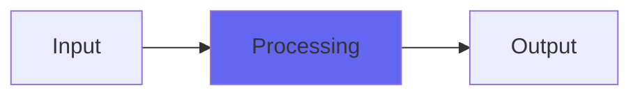

# Coils2

## Quick Info

| | |
|---|---|
| **Category** | Subtlety |
| **Type** | Subtlety |
| **Status** | Latest Release |

## Description

a transformer overdrive emulator

## Detailed Overview

This is to Coils what Srsly2 was to Srsly. In other words, Coils was always ultra subtle. Coils2 lets you dial up the cheapness until the tone is wrecked (if you so choose).

There’s two controls, Saturation and Cheapness. Saturation determines what happens outside the ‘resonant band’, and Cheapness narrows the band in which the transformer’s putting out clean, pure sound. This is not a ‘stompbox distortion’ type of distortion. It’s shaping the way the transformer produces sonority. If you narrow the ‘sonority’ band with more Cheapness, you increasingly distort and lose the lows and highs, and also get a hysteresis effect of magnetizing the transformer core. More Cheapness lets you hear the transformer crap out better when you overdrive it.

Saturation gives you the maximum overload you can get to, NOT ‘more total gain’. It’s clamping down, not boosting into. That means if you turn it up all the way you get a sort of bandpass: it’s no longer really a model, you’re hearing only what’s left over after the transformer dies. To hear the grind, you have to set it to less than full crank, and halfway should already be quite a lot of overload (except if Cheapness is really low, it might be hard to overload the transformer, so it’s a matter of taste.

That’s a lot of talk to say: play with the knobs. They should do what they’re labeled to do, and as long as you’re not thinking ‘turn everything up all the way’ you’ll be fine. It’s meant to pass through a great deal of sonority even for tiny cheap transformers, just in such a way that you can really hear it this time. Coils2 is still in the spirit of Coils, in that you’ll get the most accurate ‘modeling’ by not treating it as its own stompbox. It’s the output stage, for shaping and sculpting things that already exist. You might combine it with tube distortion effects to get an ‘amp-like’ character, or use it subtly on a 2-buss to tighten lows and give you more impact and vibe. Remember to not use too much saturation and cheapness for full mixes :)

## Signal Flow

## How It Works

Coils2 processes audio in the Subtlety category. See the description above for specific functionality.

## Usage Tips

- Start with conservative settings
- A/B compare to hear the effect clearly
- Use in context with other processing
- Trust your ears over visual meters

## Related Plugins

Browse other [Subtlety](../categories/subtlety.md) plugins.

## Technical Details

**Source Code**: [View on GitHub](https://github.com/airwindows/airwindows/tree/master/plugins/LinuxVST/src/Coils2)

**Categories**: Subtlety

**Available Formats**:
- Mac AU
- Mac VST
- Windows VST
- Linux VST

## Resources

- [All Airwindows Plugins](../../README.md)
- [Category: Subtlety](../categories/subtlety.md)
- [Airwindows Website](https://www.airwindows.com)
- [Airwindows GitHub](https://github.com/airwindows/airwindows)

---

*Part of the Airwindows plugin collection - Open source audio processing plugins*

*Last updated: 2024*
