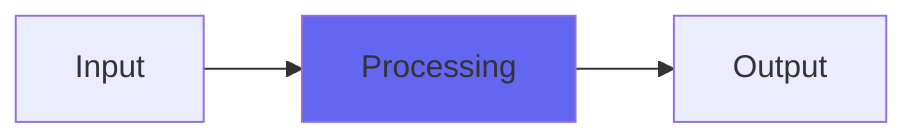

# Cojones

## Quick Info

| | |
|---|---|
| **Category** | Lo-Fi |
| **Type** | Lo-Fi |
| **Status** | Latest Release |

## Description

a new kind of distorty

## Detailed Overview

Cojones is one of the promised releases from back when I started all this. What’s interesting is, Cojones is also the seeds of Dither Me Timbers and StudioTan. That’s because it does a similar thing: it tracks the trajectory of the waveform (over five instead of three samples) and either heightens or minimizes any disparities it finds. It’s called Cojones, because I thought it highlighted that sort of quality in voices and guitars, though it’s easy to just make it be distorty and strange.

You’ll find that boosting Cojones can give a peculiar sort of midrangey sonority. I’m not going to say it’s GOOD sounding, but it is at least distinctive. There’s also a ‘breathy’ which is more three-sample stuff like Dither Me Timbers and StudioTan, and a ‘body’ control that can beef up or cut bass and low mids.

Pretty much play with it and if you hate it, throw it away and curse its name and mine. It’s all the rage! :D seriously, if you’re the sort to like this, you know who you are. If you’ve been putting Dither Me Timbers or StudioTan in places that aren’t the output dither, you need to try this instead as you’ll get a lot more out of it. And if its seasoning seems way too spicy and always produces trebly grit, try very slight amounts of its mojo, as this is one that’s set up so you can apply too much.

After all, what good is an ugly new distorty if you can’t overuse it and make unpleasant yet unrecognizable noises? :)

## Signal Flow

## How It Works

Cojones processes audio in the Lo-Fi category. See the description above for specific functionality.

## Usage Tips

- Start with conservative settings
- A/B compare to hear the effect clearly
- Use in context with other processing
- Trust your ears over visual meters

## Related Plugins

Browse other [Lo-Fi](../categories/lo-fi.md) plugins.

## Technical Details

**Source Code**: [View on GitHub](https://github.com/airwindows/airwindows/tree/master/plugins/LinuxVST/src/Cojones)

**Categories**: Lo-Fi

**Available Formats**:
- Mac AU
- Mac VST
- Windows VST
- Linux VST

## Resources

- [All Airwindows Plugins](../../README.md)
- [Category: Lo-Fi](../categories/lo-fi.md)
- [Airwindows Website](https://www.airwindows.com)
- [Airwindows GitHub](https://github.com/airwindows/airwindows)

---

*Part of the Airwindows plugin collection - Open source audio processing plugins*

*Last updated: 2024*
