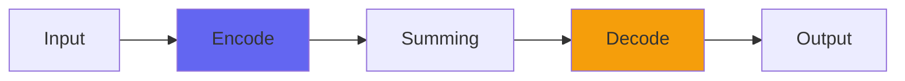

# Console7Cascade

## Quick Info

| | |
|---|---|
| **Category** | Consoles |
| **Type** | Consoles |
| **Status** | Stable |

## Description

a drop-in replacement for Console7Channel that allows for MUCH higher gain

## Detailed Overview

I heard you liked slamming consoles. So I put five individually ultrasonic-filtered stages of slamming into your console so you can slam console while you Console7 :D

This is pretty straightforward. It’s a drop-in replacement for Console7Channel, right down to the gain staging that works with the trim control to fit the result into the mix.

The difference is, this uses FIVE gain stages of the same processing in Console7Channel. And of course it’s always better (I’m learning) to filter more gently between individual stages, rather than try to super-filter all at once and then do all the distorting. And so, Console7Cascade is born: turns out to be a very very ‘consoley’ type of crunch.

By that I mean it seems to barely crunch at all. It just intensifies and gets REALLY LOUD. Might work as a guitar amp sim too? It worked so well for me on my drums that I might end up just using it by default for that: just all of the channels, all get Console7Cascade. You could also put it in place on a submix… or all the submixes, if you’re kind of insane. This produces a really intense tubey loud effect with very little scratchyness or grind. I’m pretty sure it’ll be kind of brutal on the CPU as it’s not only an Ultrasonic, but also five Console7Channels, each of which run two sine functions.

You might just find it was all worth it, though. Why compress when you can cascade Console7Channels?

## Signal Flow

## How It Works

Console7Cascade is part of the Airwindows Console system. Use the Channel version on tracks and the Buss version on the master to create a unique summing environment that adds space and dimension to your mix.

## Usage Tips

- Use matching Channel and Buss plugins (don't mix versions)
- Start with settings at 0.5 (neutral)
- Place Channel on all important tracks
- Place Buss on master fader only

## Related Plugins

Browse other [Consoles](../categories/consoles.md) plugins.

## Technical Details

**Source Code**: [View on GitHub](https://github.com/airwindows/airwindows/tree/master/plugins/LinuxVST/src/Console7Cascade)

**Categories**: Consoles

**Available Formats**:
- Mac AU
- Mac VST
- Windows VST
- Linux VST

## Resources

- [All Airwindows Plugins](../../README.md)
- [Category: Consoles](../categories/consoles.md)
- [Airwindows Website](https://www.airwindows.com)
- [Airwindows GitHub](https://github.com/airwindows/airwindows)

---

*Part of the Airwindows plugin collection - Open source audio processing plugins*

*Last updated: 2024*
