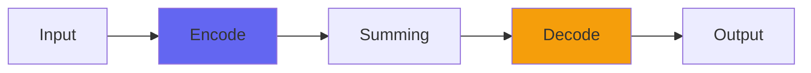

# Console8LiteBuss

## Quick Info

| | |
|---|---|
| **Category** | Consoles |
| **Type** | Consoles |
| **Status** | Stable |

## Description

simplified Console8, working with just a single mix buss

## Detailed Overview

Here's a useful update on Console8! The original Console8 was unlike any other Airwindows Console, as it's designed to be used only in a Channel/Submix/Buss configuration. Its ultrasonic filtering needs to run through all three stages in order to be set up right. Yet, Console8 also introduced other things: a custom distributed highpass algorithm for acting more like real-world analog circuits, treble softening to mimic the use of transformers, and as a result you got a distinctive sound that wasn't present in more purist Console versions.

Enter Console8Lite! Bear in mind that the full three-stage Console8 will still have a slight edge in certain ways: the interactions with the ultrasonic filtering are more intense, and things like the capacitor emulation work more effectively on the larger mix topology with more stages. But there's also a place for simpler, more direct mixers, and that's where Console8Lite comes in.

It's designed from the ground up to bring all the Console8 features but in simpler, traditional Airwindows Console form. You put the channel plugins last on each channel, have the faders at unity gain, and put the buss plugin first on the buss. Everything else, from the custom highpassing to the treble softening to the ability to boost the buss output into an on-board version of ClipOnly2, is there in the simpler form, easier to set up and ready to bring analog tone to your DAW mix.

When using it, set it up like any pre-8 version of Console. Use it as a replacement for Console8, though each plugin is roughly equivalent to a Console8 stage's In and Out run in series: if you mix and match it with Console8 full version it'll function but the ultrasonic filtering will no longer be calibrated.

Hope you like the new, simpler and more direct Console8Lite :)

## Signal Flow

## How It Works

Console8LiteBuss is part of the Airwindows Console system. Use the Channel version on tracks and the Buss version on the master to create a unique summing environment that adds space and dimension to your mix.

## Usage Tips

- Use matching Channel and Buss plugins (don't mix versions)
- Start with settings at 0.5 (neutral)
- Place Channel on all important tracks
- Place Buss on master fader only

## Related Plugins

Browse other [Consoles](../categories/consoles.md) plugins.

## Technical Details

**Source Code**: [View on GitHub](https://github.com/airwindows/airwindows/tree/master/plugins/LinuxVST/src/Console8LiteBuss)

**Categories**: Consoles

**Available Formats**:
- Mac AU
- Mac VST
- Windows VST
- Linux VST

## Resources

- [All Airwindows Plugins](../../README.md)
- [Category: Consoles](../categories/consoles.md)
- [Airwindows Website](https://www.airwindows.com)
- [Airwindows GitHub](https://github.com/airwindows/airwindows)

---

*Part of the Airwindows plugin collection - Open source audio processing plugins*

*Last updated: 2024*
