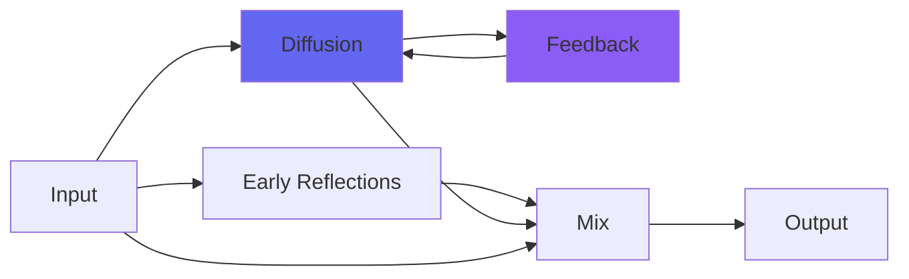

# CreamCoat

  

## Quick Info

| | |
|---|---|
| **Category** | Reverb |
| **Type** | Reverb |
| **Status** | Latest Release |

## Description

a swiss army knife reverb with soft undersampling

## Detailed Overview

Here's where the DeRez3 plugin came from. CreamCoat works as a general purpose reverb/ambience, taking the same basic algorithms from ClearCoat (when there's the Select knob and it's made out of 4x4 householder matrices, it's a Something-Coat reverb) but working an amazing trick on them that can really transform them.

It turns out you can get a smooth, lush effect out of the undersampling (no weird 'antique digital' artifacts) so long as you undersample by an exact divisor of the sample rate, and then use the Bezier curve trick to reconstruct the wave from the low sample rate.

If that was too technical, listen to the tone of the reverb as you drop the sample rate with DeRez. You'll get a series of 'steps', each of them being clean and natural-sounding, but having a very sharp cutoff. It's like a filter, but it's just how the wave is reconstructed. Using it at high sample rates is even better because it gets to reconstruct in a more finely-grained way, but also you'll get more 'DeRez' options around the area you're finding useful!

In keeping with the 'swiss army knife' concept, CreamCoat has a wide-ranging Regen control, letting you do infinite reverbs across any of the settings, or extremely short ambiences. And a Predelay control, letting you sit the short ambiences exactly where you want them.

This is almost certainly a better 'general purpose' verb than the original ClearCoat, which is simplified for ease of understanding the code. It's still pretty simple, though! I've got many more sophisticated reverbs coming or planned, but with this and CrunchCoat you should be able to cover an absurd number of bases, reverb-wise. I hope you enjoy CreamCoat!

## Signal Flow

## How It Works

CreamCoat creates spatial effects through algorithmic reverb. Use it to add depth, space, and dimension to your tracks.

## Usage Tips

- Less is often more - start conservative
- Use pre-delay for clarity
- EQ the reverb return (cut lows, sometimes highs)
- Match decay time to song tempo

## Related Plugins

Browse other [Reverb](../categories/reverb.md) plugins.

## Technical Details

**Source Code**: [View on GitHub](https://github.com/airwindows/airwindows/tree/master/plugins/LinuxVST/src/CreamCoat)

**Categories**: Reverb

**Available Formats**:
- Mac AU
- Mac VST
- Windows VST
- Linux VST

## Resources

- [All Airwindows Plugins](../../README.md)
- [Category: Reverb](../categories/reverb.md)
- [Airwindows Website](https://www.airwindows.com)
- [Airwindows GitHub](https://github.com/airwindows/airwindows)

---

*Part of the Airwindows plugin collection - Open source audio processing plugins*

*Last updated: 2024*
