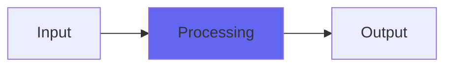

# Crystal

## Quick Info

| | |
|---|---|
| **Category** | Tone Color |
| **Type** | Tone Color |
| **Status** | Stable |

## Description

a tone shaper and buss soft-clipper

## Detailed Overview

Crystal’s the first of the Character reissues, by request: I know there’s the possibility for this to become people’s favorite plugin, because it already is one user’s favorite buss plugin and he begged me to rerelease it with updated code and VST compatibility. This is the result. Tonally it’s exactly the same as the classic ‘magic’ Audio Unit, but it’s got the denormalization and noise shaping to the floating point buss of 2018 and beyond.

The controls you’ll be interested in are Hardness and Personality. Hardness applies the same algorithm that was in ‘New Channel’: though it’s not a replacement for what made Channel special, it’s got its own uses. It lets you define the onset of clipping, whether soft-clip saturation or digital hard clipping. Though this dirties up the sound a little, it lets you dial the ‘fatness’ of the saturation effect and gives you a tonal parameter that no other Airwindows plugin gives you. Think of it as a slider for how much the roaring, overdriven midrange sticks out.

Personality is a precursor to what became BussColors (and there are other flavors to come) but in Crystal it’s a little different. The BussColors algorithms are taken from hardware convolution impulses, and there’s a time-constant making the interpolation between ‘loud’ and ‘soft’ impulses happen over several samples. In the Character plugins, this didn’t happen. It was sample-by-sample, so on the one hand there was no dynamic behavior, just each sample got a fixed convolution behavior.

On the other hand (and it took me a while to properly understand this) every convolution sample got its own, separate dynamic behavior. The curve was different for each one, so it became a more tightly controlled little kernel rather than a set of possible kernels. There are still people who swear these were the great ones, and I’ve learned to pay closer attention to such things.

And the thing is, Crystal’s not using a hardware sample. Unlike anything in BussColors, Crystal’s using a data set that comes from doing a brickwall filter: if I remember correctly, two different ones at different Q/steepness, and then generating the dynamic behavior out of that. So it’s doing a treble-restricting EQ behavior (a FIR filter), but then it manipulates that. The question is, do you like what it does? Some people really, really liked this one. Not everything about it is in line with how I usually do things. That’s why it’s different. Maybe it’s right up your alley? Let your ears guide you, and have fun checking it out.

## Signal Flow

## How It Works

Crystal processes audio in the Tone Color category. See the description above for specific functionality.

## Usage Tips

- Start with conservative settings
- A/B compare to hear the effect clearly
- Use in context with other processing
- Trust your ears over visual meters

## Related Plugins

Browse other [Tone Color](../categories/tone-color.md) plugins.

## Technical Details

**Source Code**: [View on GitHub](https://github.com/airwindows/airwindows/tree/master/plugins/LinuxVST/src/Crystal)

**Categories**: Tone Color

**Available Formats**:
- Mac AU
- Mac VST
- Windows VST
- Linux VST

## Resources

- [All Airwindows Plugins](../../README.md)
- [Category: Tone Color](../categories/tone-color.md)
- [Airwindows Website](https://www.airwindows.com)
- [Airwindows GitHub](https://github.com/airwindows/airwindows)

---

*Part of the Airwindows plugin collection - Open source audio processing plugins*

*Last updated: 2024*
