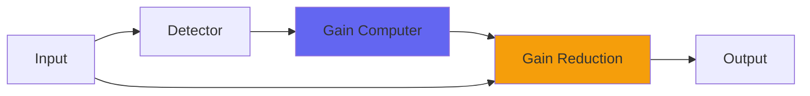

# curve

## Quick Info

| | |
|---|---|
| **Category** | Dynamics |
| **Type** | Dynamics |
| **Status** | Latest Release |

## Description

the simplest, purest form of Recurve with no extra boosts

## Detailed Overview

sometimes you just want the effect to be lowercase.

the previous plugin recurve slammed home with 6 db of gain in its compression so you could hear it working, and had a clipper on the end in case you wanted to use it as a loudenator.

but maybe you don’t. maybe the best thing for the purest, subtlest compression (the one with no transition point between getting louder and getting quieter, and no edges in the sound anywhere) is to have no gain either. it can still catch overs… most of the time, occasionally not. it can still be heard, probably, but in this form it can sit on nearly any track, unnoticed, quietly balancing levels in lowercase.

you could put it on everything, even though compression multiplies (you get the ratio of all the different compressions, times each other). curve is so calm and gentle that even putting it on all tracks and stems and then the 2-buss still shouldn’t give you a heavily compressed sound.

people have asked whether you can still do airwindows patreon for one dollar a month rather than the ‘fifty dollars a year’ concept. the answer is yes, of course, the per-plugin concept is just to give people something they can relate to. also if you can only spare one dollar a month i would rather help you. but hey, if you gotta share the love i cannot argue as it would be most hypocritical given my own fierce affections for the music producing community.

i was helping clean up my late dad’s house and got a book called archy and mehitabel. whether it influenced curve will have to remain a mystery to the non-literary. suffice to say there’s a dance in the old plugin-monger yet. whatthehell, whatthehell

<3

do 2s and 3s count as uppercase

## Signal Flow

## How It Works

curve controls dynamics through peak control. The algorithm responds to your audio in a musical way, providing transparent to aggressive dynamic control.

## Usage Tips

- Start with gentle settings and increase as needed
- Use Dry/Wet for parallel compression if available
- Listen for pumping or artifacts
- A/B bypass to check if processing helps the mix

## Related Plugins

Browse other [Dynamics](../categories/dynamics.md) plugins.

## Technical Details

**Source Code**: [View on GitHub](https://github.com/airwindows/airwindows/tree/master/plugins/LinuxVST/src/curve)

**Categories**: Dynamics

**Available Formats**:
- Mac AU
- Mac VST
- Windows VST
- Linux VST

## Resources

- [All Airwindows Plugins](../../README.md)
- [Category: Dynamics](../categories/dynamics.md)
- [Airwindows Website](https://www.airwindows.com)
- [Airwindows GitHub](https://github.com/airwindows/airwindows)

---

*Part of the Airwindows plugin collection - Open source audio processing plugins*

*Last updated: 2024*
