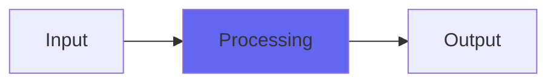

# DarkNoise

## Quick Info

| | |
|---|---|
| **Category** | Noise |
| **Type** | Noise |
| **Status** | Latest Release |

## Description

an alternative method for producing bassier noise directly. Sound design stuff

## Detailed Overview

DarkNoise is a technical experiment, that might be useful for sound design folks, or game coders, or people coding things like algorithmic clap effects. It’s basically a way to generate noise directly that’s more midrangey, or more bassy, without having to filter it (though there’s a filter included, too!)

So how it works is: if you just generate rand() every sample, that’s white noise. (or if you use an algorithm like my dithering-to-the-floating-point, which is not crypto-grade noise but runs more CPU-efficiently). And if you take a value and add rand() to it every sample, that’s Brownian noise (something moves, but randomly) but it generates DC offset and needs to get filtered. I’ve also done clever forms of noise like VoiceOfTheStarship (there in your NewUpdates.zip download for free, try it and compare with DarkNoise) which do the brownian noise, but at regular intervals it forces the random noise always to move TOWARDS zero, suppressing the DC naturally.

This is different. I’m not sure it’s better but it’s different, and what it does is: say you’re keeping a list of values that are all random. And you’re replacing them with new random values, and you get your output by adding ’em together. Now, imagine that for each random number you put in, that tells you the next position in the list to replace. That’s DarkNoise. It has a brighter top-end than VoiceOfTheStarship, and runs just as fast, but requires you keep a big pile of numbers around. However, you don’t have to actually add them all every sample. It’s in the code, how to work around that part.

Enjoy the plugin if you like weird noise sources: again, might be sound design, maybe you’d like to gate it along with something? Gate it along with your snare and pick one of the midrangey settings and you might get a nice beefy reinforcement. Cranked way up, it gives a background noise ambience that’s like wind (heard from indoors, or being out in the wind) which can go from almost still, to thousands of miles an hour.

## Signal Flow

## How It Works

DarkNoise processes audio in the Noise category. See the description above for specific functionality.

## Usage Tips

- Start with conservative settings
- A/B compare to hear the effect clearly
- Use in context with other processing
- Trust your ears over visual meters

## Related Plugins

Browse other [Noise](../categories/noise.md) plugins.

## Technical Details

**Source Code**: [View on GitHub](https://github.com/airwindows/airwindows/tree/master/plugins/LinuxVST/src/DarkNoise)

**Categories**: Noise

**Available Formats**:
- Mac AU
- Mac VST
- Windows VST
- Linux VST

## Resources

- [All Airwindows Plugins](../../README.md)
- [Category: Noise](../categories/noise.md)
- [Airwindows Website](https://www.airwindows.com)
- [Airwindows GitHub](https://github.com/airwindows/airwindows)

---

*Part of the Airwindows plugin collection - Open source audio processing plugins*

*Last updated: 2024*
