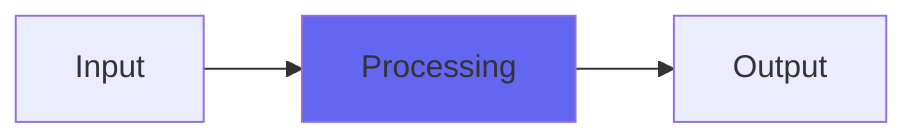

# DeBess

 

## Quick Info

| | |
|---|---|
| **Category** | Brightness |
| **Type** | Brightness |
| **Status** | Latest Release |

## Description

an improved DeEss, with perfect rejection of non-ess audio

## Detailed Overview

Meet DeBess.

Named because, for some of you at least, it is at last The Best De Ess. Period. Ever.

…assuming certain conditions.

DeBess is an extension of my former DeEss, which itself was the high point of several earlier attempts at a special de-esser with an unusual algorithm for finding specifically ess content and rejecting anything else in that frequency range, no matter how many overtones it had. DeEss used a set of sample comparisons to try and find esses, and was very successful at this… except some folks had trouble getting it to engage, and others needed it to be more perfect at rejecting even the faintest softening of other content.

DeBess does this by extending the sample comparison window a LOT. In fact, it’s now a slider! You can set it to be even blurrier than DeEss if you like… or barely crack it open to replicate the original DeEss… or crank it up for high isolation de-essing. If you are recording on prosumer equipment or using moving-coil microphones, you might not get enough change between samples to engage DeBess. Same if you’re using high sample rates and your mics do NOT extend right up as far as the sampling lets you: DeBess is not for taking stage mics and making them lisp. It is very distinctly for taking the most high-end of vocal tracks and de-essing only the ess sounds out of them, with zero cost to anything else. Whatever you’re using, if your esses are blowing out the highest treble (which is exactly what you need a de-esser for) then it ought to work for you.

If you’re using high sample rate and struggling to get DeBess action and you’re going to be treble boosting for that ultra-bright voice sound, try brightening BEFORE DeBess and you’ll probably be able to get what you need. It wants very bright esses to work with, so it can duck and darken them. Use the filter control to shape a better EQ on your esses, rather than just trying to duck ’em.

## Signal Flow

## How It Works

DeBess processes audio in the Brightness category. See the description above for specific functionality.

## Usage Tips

- Start with conservative settings
- A/B compare to hear the effect clearly
- Use in context with other processing
- Trust your ears over visual meters

## Related Plugins

Browse other [Brightness](../categories/brightness.md) plugins.

## Technical Details

**Source Code**: [View on GitHub](https://github.com/airwindows/airwindows/tree/master/plugins/LinuxVST/src/DeBess)

**Categories**: Brightness

**Available Formats**:
- Mac AU
- Mac VST
- Windows VST
- Linux VST

## Resources

- [All Airwindows Plugins](../../README.md)
- [Category: Brightness](../categories/brightness.md)
- [Airwindows Website](https://www.airwindows.com)
- [Airwindows GitHub](https://github.com/airwindows/airwindows)

---

*Part of the Airwindows plugin collection - Open source audio processing plugins*

*Last updated: 2024*
