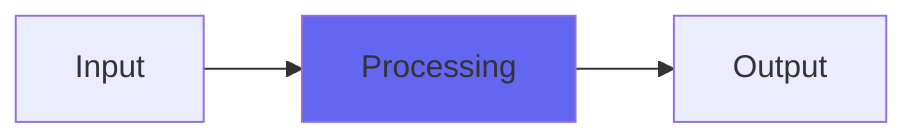

# DeEss

## Quick Info

| | |
|---|---|
| **Category** | Brightness |
| **Type** | Brightness |
| **Status** | Stable |

## Description

the best de-essing solution there is. A go-to utility plugin

## Detailed Overview

The Airwindows DeEss works by tracking slew rates, not by filtering and frequencies. It keeps a string of recent slew rates, and if it sees high slews that keep going back and forth (flipping direction) that’s how it triggers. It doesn’t trigger on things like square wave or sawtooth waves, because those aren’t going back and forth fast enough to be an ess. It’s purely mechanical: the trigger for DeEss happens instantly and way more powerfully on real esses, making it extremely easy to set. It’s not fiddly, just crank up the effect so you can plainly hear where it hits and use that (don’t overtrigger, for the bad esses you’ll get a HUGE powerful trigger even when everything else is totally clear of de-essing)

Then you use the ducking control and the treble rolloff to tailor the kind of esses you do want. The tone thing lets you have darker esses that are still very audible, and the ducking control means you can retain the original sound but duck it as much as you like. It should be possible to template it: since it triggers so powerfully on real esses, if you’ve got a working setting it should always work. De-essing is now a solved problem, for good. Use good taste (avoid ‘lisping’ effects) and de-essing is easy.

## Signal Flow

## How It Works

DeEss processes audio in the Brightness category. See the description above for specific functionality.

## Usage Tips

- Start with conservative settings
- A/B compare to hear the effect clearly
- Use in context with other processing
- Trust your ears over visual meters

## Related Plugins

Browse other [Brightness](../categories/brightness.md) plugins.

## Technical Details

**Source Code**: [View on GitHub](https://github.com/airwindows/airwindows/tree/master/plugins/LinuxVST/src/DeEss)

**Categories**: Brightness

**Available Formats**:
- Mac AU
- Mac VST
- Windows VST
- Linux VST

## Resources

- [All Airwindows Plugins](../../README.md)
- [Category: Brightness](../categories/brightness.md)
- [Airwindows Website](https://www.airwindows.com)
- [Airwindows GitHub](https://github.com/airwindows/airwindows)

---

*Part of the Airwindows plugin collection - Open source audio processing plugins*

*Last updated: 2024*
