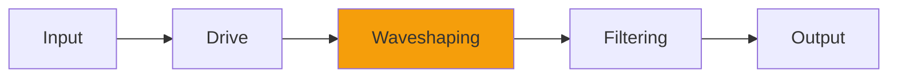

# Density

## Quick Info

| | |
|---|---|
| **Category** | Distortion |
| **Type** | Distortion |
| **Status** | Stable |

## Description

a Swiss Army Knife of saturation/antisaturation

## Detailed Overview

This one started a lot! The algorithm used here has echoed through many other Airwindows plugins. It’s literally the smoothest saturation you can have in a plugin: the transfer function’s a sine. This is what’s in Channel, too: there are many ways to adapt such a simple mathematical function.

But there’s more! Because Density runs multiple stages, allowing it to bulk up the tone into an overblown, insanely fat and saturated distort-fest. And then you can highpass just the distorted stuff alone, and trim its output gain, and mix it with the unfiltered dry to produce lots of tonal possibilities. And then there’s the spatial positioning factor: saturating stuff this way brings it forward in the mix. You can also isolate midrangey elements and bring them forward using that trick.

And then there’s the negative values: if you UNsaturate, you get a thinned out lean tone and it drops back instead of pushing forward. And you can blend that too.

Density’s one of the better utility plugins. It’s there to reshape tones in myriad ways, mostly having to do with fatness or thinness, also having to do with upfrontness or recedingness. It can also give articulation to sounds that are murky, or simply produce the hugest fattest roaring wall of grunge you ever heard.

## Signal Flow

## How It Works

Density adds harmonics and edge through distortion. Use it for adding grit, warmth, or aggressive processing.

## Usage Tips

- Start with conservative settings
- A/B compare to hear the effect clearly
- Use in context with other processing
- Trust your ears over visual meters

## Related Plugins

Browse other [Distortion](../categories/distortion.md) plugins.

## Technical Details

**Source Code**: [View on GitHub](https://github.com/airwindows/airwindows/tree/master/plugins/LinuxVST/src/Density)

**Categories**: Distortion

**Available Formats**:
- Mac AU
- Mac VST
- Windows VST
- Linux VST

## Resources

- [All Airwindows Plugins](../../README.md)
- [Category: Distortion](../categories/distortion.md)
- [Airwindows Website](https://www.airwindows.com)
- [Airwindows GitHub](https://github.com/airwindows/airwindows)

---

*Part of the Airwindows plugin collection - Open source audio processing plugins*

*Last updated: 2024*
