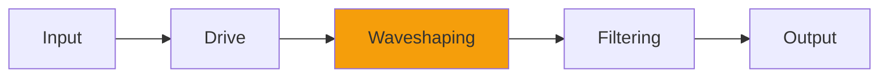

# Density2

## Quick Info

| | |
|---|---|
| **Category** | Distortion |
| **Type** | Distortion |
| **Status** | Latest Release |

## Description

a different color for Density, some old code I had that people wanted

## Detailed Overview

So in the absence of somebody coming forth and saying ‘this is on my quadrillion selling hit record’… weirder things have happened, occasionally to me… you should consider this as an alternate tone for Density. It’s been around for a while, but people wanted to see it again: specifically, to see it run on modern machines and in VST and so on. How could I say no? I’ve altered it as little as possible: there were always some weird things about it, but I refactored it to retain EVERYTHING unintentional or unusual. I gave it modern Airwindows handling of denormalized numbers, and it dithers to floating point instead of using the noise shaping to floating point that I used back then. Everything else is just as it was: no ‘fixing’ or making it do what I ‘meant to do’.

…this is on somebody's quadrillion selling hit record. I'm still not going to tell you who, or how they used it. <3

## Signal Flow

## How It Works

Density2 adds harmonics and edge through distortion. Use it for adding grit, warmth, or aggressive processing.

## Usage Tips

- Start with conservative settings
- A/B compare to hear the effect clearly
- Use in context with other processing
- Trust your ears over visual meters

## Related Plugins

Browse other [Distortion](../categories/distortion.md) plugins.

## Technical Details

**Source Code**: [View on GitHub](https://github.com/airwindows/airwindows/tree/master/plugins/LinuxVST/src/Density2)

**Categories**: Distortion

**Available Formats**:
- Mac AU
- Mac VST
- Windows VST
- Linux VST

## Resources

- [All Airwindows Plugins](../../README.md)
- [Category: Distortion](../categories/distortion.md)
- [Airwindows Website](https://www.airwindows.com)
- [Airwindows GitHub](https://github.com/airwindows/airwindows)

---

*Part of the Airwindows plugin collection - Open source audio processing plugins*

*Last updated: 2024*
