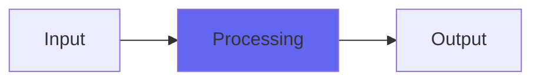

# Desk

## Quick Info

| | |
|---|---|
| **Category** | Subtlety |
| **Type** | Subtlety |
| **Status** | Stable |

## Description

classic Airwindows subtle analog modeling

## Detailed Overview

Desk is a little bit like a precursor to ‘PurestDrive’. It’s entirely an analog modeler, with a behavior that’s far from a plugin stomp-box distortion. It glues and thickens the sound, with a headroom of about 30 dB, much like a true analog console (those don’t turn into distorto-pedals the instant you hit 0 dB). Desk is the canonical version of this type of sound processing.

Note that it’s not tricky to use like Console4. It’s not calibrated to work as a ConsoleChannel replacement (that’s the most recent Desk3, which is one of the Kagi plugins to be released later). It doesn’t have elaborate tone colors added like BussColors3 (also a Kagi plugin). It’s not obvious in normal use, not adjustable like some of these plugins. In normal operation you’re miles from clipping it anyway, and get only a subtle glue and tone shaping.

But what it IS… is classic Airwindows tone coloring brought up to 2017 standards. You can stick Desk on any channel, any submix or buss, the 2-buss, or all of the above. The more places you put it, the more obvious the analogifying becomes. And since it’s Airwindows tone and transparency, you can put it up against any ‘analog modeler’ by anybody, at any price or subscription fee, and it should beat everything and give a bigger, punchier sound. If it’s ‘analog warming’ and tone you want, and you require the sound not to turn into digital sludge and glitter, this is the one.

As a further note, the reason I've been willing to engage in hype like the above is a fundamental Airwindows principle: less is more. What Desk does is very simple and minimal. Doing less to the digital signal generally hurts the tone less. So, as long as you're getting enough 'analog tone shaping' cues in the particular ways Desk does them, it is actually true that if you find a plugin that does this as minimally as possible, with the fewest math operations, it is likely to sound bigger and punchier and better than more elaborate processing.

## Signal Flow

## How It Works

Desk processes audio in the Subtlety category. See the description above for specific functionality.

## Usage Tips

- Start with conservative settings
- A/B compare to hear the effect clearly
- Use in context with other processing
- Trust your ears over visual meters

## Related Plugins

Browse other [Subtlety](../categories/subtlety.md) plugins.

## Technical Details

**Source Code**: [View on GitHub](https://github.com/airwindows/airwindows/tree/master/plugins/LinuxVST/src/Desk)

**Categories**: Subtlety

**Available Formats**:
- Mac AU
- Mac VST
- Windows VST
- Linux VST

## Resources

- [All Airwindows Plugins](../../README.md)
- [Category: Subtlety](../categories/subtlety.md)
- [Airwindows Website](https://www.airwindows.com)
- [Airwindows GitHub](https://github.com/airwindows/airwindows)

---

*Part of the Airwindows plugin collection - Open source audio processing plugins*

*Last updated: 2024*
