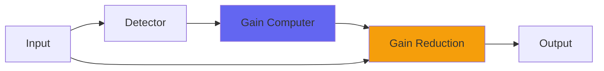

# DigitalBlack

  

## Quick Info

| | |
|---|---|
| **Category** | Dynamics |
| **Type** | Dynamics |
| **Status** | Latest Release |

## Description

a quick, staccato gate

## Detailed Overview

So here’s a gate. And here is why you should care :D

DigitalBlack is real simple on the surface: a threshold, and a dry/wet control. But what it does is more complicated. This isn’t a ‘gently fade to silence’ gate like SoftGate, or a ‘special effect’ like Gatelope. DigitalBlack was designed for one purpose: tightening up staccato direct-recorded tracks. I’m demonstrating it with a worst-case scenario because that’s all I had: I don’t get to do music, mostly, except for my live jams. But I had a drum room track where you can get some idea: play with it yourself if you’re curious, it’s free.

DigitalBlack does three things that are interesting, two of which are pretty unique. Firstly, it uses hysteresis to prevent ‘sputtering’. That’s pretty normal. Second, it fades not with a simple volume, instead it fades into negative Density (bulk of the sound attenuated, only the transients stick out) which has the effect of sounding like it’s fading backwards away from you, very quick. This gives it a physical motion not common to gates. And third, it tracks zero crossings in a special way so that the ‘silence’ time it has to traverse, before hitting the negative Density area and then true silence, is related to the bassiness of the content.

What this means is, if you’re hitting it with bassy content it’ll handle that gracefully. If you’ve got loads of midrange, it’ll gate that tighter. And if you’re making bright trebly sounds without a lot of bass, it’ll gate those FAST. And you can hear this on my lame demo, because in situations where only the initial spike of the drum hit got through on one side? (this is not linked: it’s designed so you could throw it on a submix with different stuff happening on L and R so it’s dual-mono) Even in my demo you can hear that some of those attacks are chopped off insanely fast. You’ll probably recognize pretty quickly if this is the gate for you. Try it on something like a DI guitar going into heavy ampsims, and see if you can’t get good results out of it. Put it on something like a kick or on individual drum mics (that you’re not already using Gatelope on), or on anything that needs to be insanely tight and quick to gate itself. It might be just what you needed. (for linked gentler slower gating to silence, try SoftGate: for a gate that also acts like envelope filters, use Gatelope)

## Signal Flow

## How It Works

DigitalBlack controls dynamics through peak control. The algorithm responds to your audio in a musical way, providing transparent to aggressive dynamic control.

## Usage Tips

- Start with gentle settings and increase as needed
- Use Dry/Wet for parallel compression if available
- Listen for pumping or artifacts
- A/B bypass to check if processing helps the mix

## Related Plugins

Browse other [Dynamics](../categories/dynamics.md) plugins.

## Technical Details

**Source Code**: [View on GitHub](https://github.com/airwindows/airwindows/tree/master/plugins/LinuxVST/src/DigitalBlack)

**Categories**: Dynamics

**Available Formats**:
- Mac AU
- Mac VST
- Windows VST
- Linux VST

## Resources

- [All Airwindows Plugins](../../README.md)
- [Category: Dynamics](../categories/dynamics.md)
- [Airwindows Website](https://www.airwindows.com)
- [Airwindows GitHub](https://github.com/airwindows/airwindows)

---

*Part of the Airwindows plugin collection - Open source audio processing plugins*

*Last updated: 2024*
