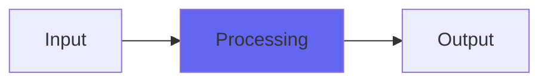

# Disintegrate

## Quick Info

| | |
|---|---|
| **Category** | Effects |
| **Type** | Effects |
| **Status** | Latest Release |

## Description

Discontinuity on steroids

## Detailed Overview

So what if you had a distortion that wasn't actually about distortion?

Disintegrate extends Discontinuity to the point of total unreality.

This algorithm was invented to emulate the asymmetrical compression of air, and already exists in Discontinuity and ConsoleX. You set it according to what at the point of clipping, would be the physical loudness in air, and it applies a delay modulation that distorts the sound. It's meant to reproduce what happens when a huge rocket launch, heard from miles away, turns into strange air crackles (a natural phenomenon having to do with pressure discontinuities in the speed of sound). This happens in all sound transmitted through air, all of the time, and Discontinuity scales it appropriately.

Thing is, Discontinuity is designed to sound nice and not too crazy. So… why not go for broke?

All the controls on Disintegrate are things that are under the hood on Discontinuity. It's designed to let you get inappropriate noises, unnatural sounds. Typically it sounds like distortions, but it's not: it's a stack of modulating delay lines, but rather than modulating by an LFO, the sound's modulated by itself, over and over. When you get into distortion-like edge, that's mostly the frequencies stacking up, though it does have the ability to overdrive internally. In particular, Disintegrate takes pains to overdrive internally, the better to sonically obliterate and destroy.

Hope you like Disintegrate! I'll work on more realistic things soon! :)

## Signal Flow

## How It Works

Disintegrate processes audio in the Effects category. See the description above for specific functionality.

## Usage Tips

- Start with conservative settings
- A/B compare to hear the effect clearly
- Use in context with other processing
- Trust your ears over visual meters

## Related Plugins

Browse other [Effects](../categories/effects.md) plugins.

## Technical Details

**Source Code**: [View on GitHub](https://github.com/airwindows/airwindows/tree/master/plugins/LinuxVST/src/Disintegrate)

**Categories**: Effects

**Available Formats**:
- Mac AU
- Mac VST
- Windows VST
- Linux VST

## Resources

- [All Airwindows Plugins](../../README.md)
- [Category: Effects](../categories/effects.md)
- [Airwindows Website](https://www.airwindows.com)
- [Airwindows GitHub](https://github.com/airwindows/airwindows)

---

*Part of the Airwindows plugin collection - Open source audio processing plugins*

*Last updated: 2024*
