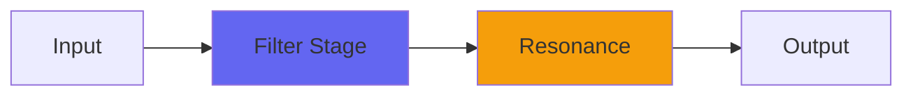

# Distance2

## Quick Info

| | |
|---|---|
| **Category** | Filter |
| **Type** | Filter |
| **Status** | Stable |

## Description

a versatile space shaper for creating depth

## Detailed Overview

As requested, this is the unholy hybrid of Distance and Atmosphere. This one doesn’t work like a Console5 system, it’s strictly ‘put it on and get a sound’, but I wasn’t expecting how cool it would be. Turns out this thing is completely absurdly good at taking tracks like drums, and making them huge and pounding and stage-like, without even the use of reverb or compression.

The beginning of the video’s about using Distance2 as a loudenator, though I think using it on a full mix is overkill (maybe you want SOME elements to be up front and present). Bear in mind that you can keep the Atmosphere control set very low and still get an effect: the equivalent to the Atmosphere mixing system is to have it incredibly low, like 0.1 or less. The more you push it, the more nasty it’ll get, because that algorithm alone is NOT enough to make a distance sound. It’s not doing any of the high frequency attenuation you’d get, so technically the sound of high Atmosphere settings is the sound of extreme loudness rupturing the air and your eardrums: pushed hard, it’s unrecognizable as any natural sound. You wouldn’t survive exposure to a sound so loud that it broke the air like that.

But when you also include the Darken control, that’s when things start sounding realistic again. This is one of those plugins where I could have built these into a single control to deliver good-sounding results no matter what setting you used… and where I chose to give you access to the wrongest possible settings because people NEED to break rules sometimes. Somebody out there is going to be able to get a great sound by taking the right source, and obliterating it with extreme Distance2 settings, and who am I to stand in the way? And you can also apply a dry/wet that will conceal the wreckage: surprisingly small amounts of dry signal will mask the amount of distortion going on.

And the reason I’m able to put out a plugin where I KNOW that some people will set it wrongly and then hate it, is my Patreon. The thing about Patreon is that when it works, I’m completely protected from having to make things market friendly. Market friendly is a curse: it makes you do only predictable things that most people would like, and it punishes you if you want to do something unpopular, or if you want to take something great and widen the range until people get into trouble with it. It’s safer to give people presets that are known to behave on all source audio, that always sound nice. It’s safer to give people a pile of mulch than a chainsaw.

Patreon lets me give you the chainsaw :D now, whether you do damage with it is your own affair. But I think once you strap it across some buss with drums or guitars or whatever, and fire it up, you’ll like chainsaws too. Just remember to dial it back when you need it not to be distractingly obnoxious. Or not: hey, it IS a distinct new distortion voice, with a whole new approach to slew clipping not previously available. Darken it or not, as it pleases you. Have fun.

## Signal Flow

## How It Works

Distance2 shapes frequencies through filtering. Use it for tone shaping, problem solving, or creative sound design.

## Usage Tips

- Make small adjustments - EQ is powerful
- Cut first, boost second (if needed)
- Check your changes in context with the full mix
- Use solo to identify problem frequencies

## Related Plugins

Browse other [Filter](../categories/filter.md) plugins.

## Technical Details

**Source Code**: [View on GitHub](https://github.com/airwindows/airwindows/tree/master/plugins/LinuxVST/src/Distance2)

**Categories**: Filter

**Available Formats**:
- Mac AU
- Mac VST
- Windows VST
- Linux VST

## Resources

- [All Airwindows Plugins](../../README.md)
- [Category: Filter](../categories/filter.md)
- [Airwindows Website](https://www.airwindows.com)
- [Airwindows GitHub](https://github.com/airwindows/airwindows)

---

*Part of the Airwindows plugin collection - Open source audio processing plugins*

*Last updated: 2024*
