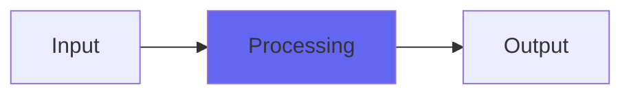

# DubCenter

## Quick Info

| | |
|---|---|
| **Category** | Bass |
| **Type** | Bass |
| **Status** | Latest Release |

## Description

a version of DubSub where the bass reinforcement is purely mono

## Detailed Overview

So here’s DubSub (below) with mono bass. This isn’t the last you’ll hear of this tool as I have BassKit coming out (which is the more approachable, well-behaved version of DubCenter) but this is the one that will let you get the most extreme. If you were using DubSub to its fullest, this one lets you do the same only with the bass and sub outputs centered.

The reason you’d want to do that is, whether for sound reinforcement or vinyl mastering there’s little reason to have stereo bass. It just makes the woofers fight each other, below a certain frequency (which depends on how far apart your speakers are). This is why elliptical EQs exist.

And the thing with DubCenter is, you don’t have to filter the original audio or mid/side it! All you have to do is use DubCenter to reinforce the bass, and it’ll automatically make that added content mono. This is even better than using (for instance) ToTape and its head bump mechanics to reinforce bass, because that (like a real tape deck) produces a stereo head bump. This produces the same fullness with the same algorithm, but it’s strictly mono so you get the effect of an elliptical EQ without having to run one! Only the super-deep stuff gets reinforced and the information and phase relationships of your original mix go untampered with.

Again, BassKit will do this in a super-convenient way with much of the tweeky functionality simplified or taken out (for that one, there is no chance of abusing the sub-octave to do weird stuff as it’s restricted to only convincing subs content) but DubCenter is the one like DubSub, where you can make it do crazy things. You’ll find it in your plugin menu next to DubSub, most likely. Have fun!

## Signal Flow

## How It Works

DubCenter processes audio in the Bass category. See the description above for specific functionality.

## Usage Tips

- Start with conservative settings
- A/B compare to hear the effect clearly
- Use in context with other processing
- Trust your ears over visual meters

## Related Plugins

Browse other [Bass](../categories/bass.md) plugins.

## Technical Details

**Source Code**: [View on GitHub](https://github.com/airwindows/airwindows/tree/master/plugins/LinuxVST/src/DubCenter)

**Categories**: Bass

**Available Formats**:
- Mac AU
- Mac VST
- Windows VST
- Linux VST

## Resources

- [All Airwindows Plugins](../../README.md)
- [Category: Bass](../categories/bass.md)
- [Airwindows Website](https://www.airwindows.com)
- [Airwindows GitHub](https://github.com/airwindows/airwindows)

---

*Part of the Airwindows plugin collection - Open source audio processing plugins*

*Last updated: 2024*
