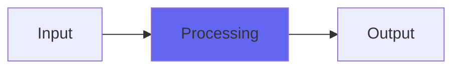

# DubSub2

 

## Quick Info

| | |
|---|---|
| **Category** | Bass |
| **Type** | Bass |
| **Status** | Latest Release |

## Description

the essence of the Airwindows head bump

## Detailed Overview

The final element for reinventing ToTape is in place, with DubSub2!

I've always used this one particular algorithm, both for ToTape and for various bass-emphasis plugins. It acts like a combination between an IIR filter and a saturation. And it's got fantastic sound, but with a catch: it has to be controlled in the higher frequencies or it'll sound growly and distorted if you push it, and it's unstable.

That's literal. I have to do stuff to control it or it will throw bass so hard that it sits around pushing DC. The algorithm has to be filtered because it's unstable, it'll constantly bring up deep bass no matter what. The sound of it is intrinsically tied to this behavior.

So, what if I tried the technique I use in Parametric, and set up some biquad filters as bandpasses, and then stack them (slightly staggered, for tone purposes) to get better rejection of unwanted DC energy? What could go wrong? Well… it's tricky. If you do that, phase shifts will cause there to be a cancellation around the bandpass frequency. You'll get notches, the placement depending on what your filter bandwidth is.

But hang on. Jack Endino's got a webpage where he's measured lots of real analog tape machines, showing the head bumps. And the thing is, on his measurements there's consistently a notch there, too. It's exactly an octave above the head bump, and that's part of the sound.

So what's the bandpass resonance, when you're using two of them stacked, and then you want the notch produced by the phase shifting (already an unusual choice) to line up exactly an octave over the head bump resonance, so that your DubSub2 head bump will consistently behave like the real thing? You can set the head bump frequency to whatever you like (Jack finds that doubling the track width halves the head bump frequency, and of course going from 15 ips to 30 ips doubles the head bump frequency, and the notch stays exactly an octave higher). But the Q is what positions that notch. Since there is clearly no correct value for such a bizarre experiment, since super-shallow Q won't work, since using Butterworth (0.7071) is slightly too tight… what's the resonance number for the two stacked bandpasses?

The golden ratio.

…hope you enjoy DubSub2, and this is what will become the head bump for ToTape7 :)

## Signal Flow

## How It Works

DubSub2 processes audio in the Bass category. See the description above for specific functionality.

## Usage Tips

- Start with conservative settings
- A/B compare to hear the effect clearly
- Use in context with other processing
- Trust your ears over visual meters

## Related Plugins

Browse other [Bass](../categories/bass.md) plugins.

## Technical Details

**Source Code**: [View on GitHub](https://github.com/airwindows/airwindows/tree/master/plugins/LinuxVST/src/DubSub2)

**Categories**: Bass

**Available Formats**:
- Mac AU
- Mac VST
- Windows VST
- Linux VST

## Resources

- [All Airwindows Plugins](../../README.md)
- [Category: Bass](../categories/bass.md)
- [Airwindows Website](https://www.airwindows.com)
- [Airwindows GitHub](https://github.com/airwindows/airwindows)

---

*Part of the Airwindows plugin collection - Open source audio processing plugins*

*Last updated: 2024*
