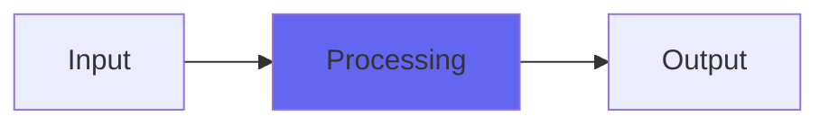

# DustBunny

## Quick Info

| | |
|---|---|
| **Category** | Lo-Fi |
| **Type** | Lo-Fi |
| **Status** | Latest Release |

## Description

unpredictable distorty noise, like dust wedged under your turntable needle

## Detailed Overview

And then sometimes there’s a plugin that just makes you go ‘wut’…

DustBunny was an accident. I was doing something and put out a plugin (possibly a freebie) and there was a bug and I was in a hurry and put it out without checking… and quickly learned something horrible was wrong. Initial reports were along the lines of ‘oops’ and ‘yikes’, and when I checked, sure enough, the plugin erupted in terrible scrunch, and I in turn erupted in apologies and scrambled to fix the problem (which wasn’t that hard).

But even before I’d got the fix out (and simple oversight problems, I sometimes fix within hours), more reports were coming in: hold on, don’t fix it, it’s cool!

That wasn’t what I had in mind, but the solution was obvious: DustBunny was born. This twisted little plugin just applies a weird accidental scrunch based on where the bunny control is set. Please don’t use it on the 2-buss, or in mastering :) but more seriously, this is born to sit inside some kind of weird plugin matrix device as part of a nefarious sound design idea. It would’ve been perfect in one of the parallel effect chains used on the latest DOOM soundtrack, mangling a sinewave. If you hit it with high levels it gets kind of jumpy, so you might want to give it more restrained levels. If you don’t like running a gain trim in front of it, run something more amusing like a delay or a flanger to pad your signal a touch.

DustBunny is kind of like a joke, except for it’s real and does produce an unusual, distinctive effect (or 1000, as all the settings are kind of unique).

## Signal Flow

## How It Works

DustBunny processes audio in the Lo-Fi category. See the description above for specific functionality.

## Usage Tips

- Start with conservative settings
- A/B compare to hear the effect clearly
- Use in context with other processing
- Trust your ears over visual meters

## Related Plugins

Browse other [Lo-Fi](../categories/lo-fi.md) plugins.

## Technical Details

**Source Code**: [View on GitHub](https://github.com/airwindows/airwindows/tree/master/plugins/LinuxVST/src/DustBunny)

**Categories**: Lo-Fi

**Available Formats**:
- Mac AU
- Mac VST
- Windows VST
- Linux VST

## Resources

- [All Airwindows Plugins](../../README.md)
- [Category: Lo-Fi](../categories/lo-fi.md)
- [Airwindows Website](https://www.airwindows.com)
- [Airwindows GitHub](https://github.com/airwindows/airwindows)

---

*Part of the Airwindows plugin collection - Open source audio processing plugins*

*Last updated: 2024*
