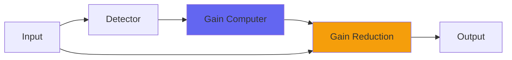

# Dynamics

## Quick Info

| | |
|---|---|
| **Category** | Dynamics |
| **Type** | Dynamics |
| **Status** | Latest Release |

## Description

a combination compressor gate

## Detailed Overview

Dynamics started with a request: the gate, from CStrip, on its own. Then I thought, what if I included the compression too? I could tweak both and see if I could make 'em better for the new plugin. And then I thought, what would it be like if I combined them into a single dynamics object?

I think it worked.

Dynamics can be very transparent, or you can crank the speed and intensity to be hyper-squished… but since it's a single plugin, you can hypercompress AND gate as a unit. That means you're triggering the gate off the source audio, you're able to control the closing of the gate like it's raw sound, but the sound you're gating is the compressed one. And that means terrific control and cleanness on the sculpted, tightened sounds. I've designed it so you can make it gate on almost anything, and squish very aggressively. It's unlinked so you can use it on a stereo submix with distinct parts for each side, or put it on a mono track to control and shape it.

## Signal Flow

## How It Works

Dynamics controls dynamics through peak control. The algorithm responds to your audio in a musical way, providing transparent to aggressive dynamic control.

## Usage Tips

- Start with gentle settings and increase as needed
- Use Dry/Wet for parallel compression if available
- Listen for pumping or artifacts
- A/B bypass to check if processing helps the mix

## Related Plugins

Browse other [Dynamics](../categories/dynamics.md) plugins.

## Technical Details

**Source Code**: [View on GitHub](https://github.com/airwindows/airwindows/tree/master/plugins/LinuxVST/src/Dynamics)

**Categories**: Dynamics

**Available Formats**:
- Mac AU
- Mac VST
- Windows VST
- Linux VST

## Resources

- [All Airwindows Plugins](../../README.md)
- [Category: Dynamics](../categories/dynamics.md)
- [Airwindows Website](https://www.airwindows.com)
- [Airwindows GitHub](https://github.com/airwindows/airwindows)

---

*Part of the Airwindows plugin collection - Open source audio processing plugins*

*Last updated: 2024*
