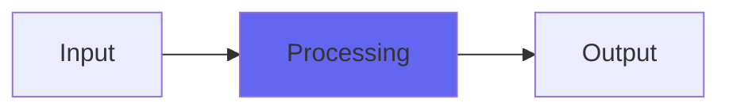

# Elation

## Quick Info

| | |
|---|---|
| **Category** | Tone Color |
| **Type** | Tone Color |
| **Status** | Latest Release |

## Description

a re-release of another old Character plugin

## Detailed Overview

This is Elation, which is NOT REALLY a sort of LA-2A like thing. That’s because it builds a distinct sound out of LA-2A convolution impulses, makes it already not an LA-2A, and then doesn’t properly compress :D it does something, but it doesn’t count as compressing. I’m not sure what I was up to here.

But it’s got the Character plugin ‘character slider’ that lets you greatly accentuate the tonal effect (this is another one that steals bass if that interests you) and a drive slider that lets you crunch things, and unlike typical plugins it has a dry/wet on the top for some reason! So, if you’re looking for a ‘analog-ifier’ based on dynamic convolution that can hype up a sound in an interesting way, and it’s important to you that you use something other people won’t have or aren’t using, this is your silver bullet: like the other Character plugins, it’s a weird secret weapon that won’t sound like other peoples’ plugin chains. If you can work with what this one has, then you can bring a bit of color that people won’t have constantly heard.

## Signal Flow

## How It Works

Elation processes audio in the Tone Color category. See the description above for specific functionality.

## Usage Tips

- Start with conservative settings
- A/B compare to hear the effect clearly
- Use in context with other processing
- Trust your ears over visual meters

## Related Plugins

Browse other [Tone Color](../categories/tone-color.md) plugins.

## Technical Details

**Source Code**: [View on GitHub](https://github.com/airwindows/airwindows/tree/master/plugins/LinuxVST/src/Elation)

**Categories**: Tone Color

**Available Formats**:
- Mac AU
- Mac VST
- Windows VST
- Linux VST

## Resources

- [All Airwindows Plugins](../../README.md)
- [Category: Tone Color](../categories/tone-color.md)
- [Airwindows Website](https://www.airwindows.com)
- [Airwindows GitHub](https://github.com/airwindows/airwindows)

---

*Part of the Airwindows plugin collection - Open source audio processing plugins*

*Last updated: 2024*
