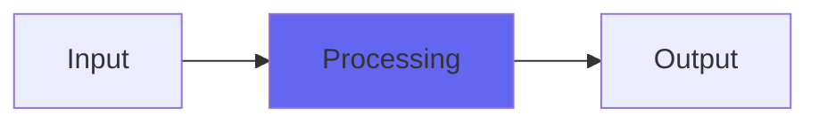

# ElectroHat

## Quick Info

| | |
|---|---|
| **Category** | Noise |
| **Type** | Noise |
| **Status** | Latest Release |

## Description

a hi-hat tone generator that uses the original sound as a control voltage

## Detailed Overview

I’ve always liked this one. ElectroHat uses primitive residue sequences to produce a ‘noise’ like effect that makes the hi-hat, but since it’s such a crude method of generating randomness, you get artifacts and peculiar electronic noises instead of nice pure noise. Peculiar electronic noises turn out to be a lot of fun as hi-hats!

You use this by feeding some sort of control voltage to it. It responds very, very quickly, so if there’s any amplitude modulation as part of your wave, you’ll hear it affecting the hat. You can use that on purpose, you can use a real DC control voltage to drive it, or you can simply make the envelope you want using a square wave tone for the underlying signal: it’ll rectify the squarewave to be only positive, and that’ll end up the same as a control voltage.

## Signal Flow

## How It Works

ElectroHat processes audio in the Noise category. See the description above for specific functionality.

## Usage Tips

- Start with conservative settings
- A/B compare to hear the effect clearly
- Use in context with other processing
- Trust your ears over visual meters

## Related Plugins

Browse other [Noise](../categories/noise.md) plugins.

## Technical Details

**Source Code**: [View on GitHub](https://github.com/airwindows/airwindows/tree/master/plugins/LinuxVST/src/ElectroHat)

**Categories**: Noise

**Available Formats**:
- Mac AU
- Mac VST
- Windows VST
- Linux VST

## Resources

- [All Airwindows Plugins](../../README.md)
- [Category: Noise](../categories/noise.md)
- [Airwindows Website](https://www.airwindows.com)
- [Airwindows GitHub](https://github.com/airwindows/airwindows)

---

*Part of the Airwindows plugin collection - Open source audio processing plugins*

*Last updated: 2024*
