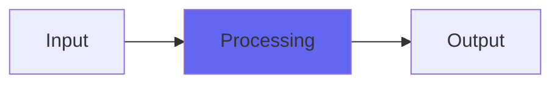

# Ensemble

## Quick Info

| | |
|---|---|
| **Category** | Ambience |
| **Type** | Ambience |
| **Status** | Latest Release |

## Description

a weird flangey little modulation effect

## Detailed Overview

Here’s a further experiment along the lines of Chorus and ChorusEnsemble! This one is more in the ‘unique because it’s kind of lame’ category. I like being able to do this sort of thing, because in this 2017 plugin business, everything you do has to be the hippest trendiest most popular thing or you’re basically doomed to get squished like a bug.

But hey! I’m doing a Patreon, not a ‘business’ of selling ‘hit plugins’ that are ‘the best plugins’. And therefore, nothing’s stopping me from putting out something that’s not an emulation of some famous hardware manufacturer’s property (and putting them out of business, eventually). My stuff doesn’t have to be the target market for what people have learned to want the most over the years (often for good reason). Heck, my plugins don’t have to have a reason! And most importantly, my plugins don’t have to succeed. They can exist (and be updated, etc) even if only a few people out there like them… or even if unpopular people like them.

Kind of punk, or something (stay tuned for some major DIY Airwindows stuff coming down the pike along those lines).

So, here’s Ensemble. It’s a weird, unique little sound. It was meant to be a big pad thickener with great richness and depth. Well, you can throw on a bunch of bass, but it’s more like ‘cheesey string ensemble synthesizer from the 70s’, and that by accident, so it’s not even a specific (branded!) string ensemble synthesizer from the 70s. It’s kind of an annoying sound, I think.

It’s free, so if you think you might have use for that, have fun with it! I’m off to make something else :)

## Signal Flow

## How It Works

Ensemble processes audio in the Ambience category. See the description above for specific functionality.

## Usage Tips

- Start with conservative settings
- A/B compare to hear the effect clearly
- Use in context with other processing
- Trust your ears over visual meters

## Related Plugins

Browse other [Ambience](../categories/ambience.md) plugins.

## Technical Details

**Source Code**: [View on GitHub](https://github.com/airwindows/airwindows/tree/master/plugins/LinuxVST/src/Ensemble)

**Categories**: Ambience

**Available Formats**:
- Mac AU
- Mac VST
- Windows VST
- Linux VST

## Resources

- [All Airwindows Plugins](../../README.md)
- [Category: Ambience](../categories/ambience.md)
- [Airwindows Website](https://www.airwindows.com)
- [Airwindows GitHub](https://github.com/airwindows/airwindows)

---

*Part of the Airwindows plugin collection - Open source audio processing plugins*

*Last updated: 2024*
